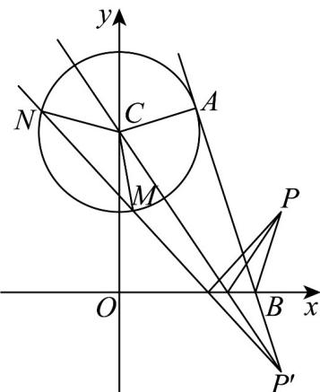

> [!faq]- 《专题09 直线与圆及圆与圆的位置关系高频题型精准突破（九大题型）（高效培优期末专项训练）》官方解析
>
> > [!success]- **【答案】** ACD
>
> > [!note]- **【分析】**
> > 由对称的性质直接求解判断 $^{A}$ ；由题意反射光线所在的直线过点 $P'(2,-1)$ ，利用对称性及圆的性质求得 $|P'A|$ ，进而可得 $|PB|+|BA|$ 判断 $^{B}$ ；由题意可知入射光线所在的直线过点 $P(2,1)$ 和 $(0,-2)$ ，即可求出直线方程判断 $C$ ；设 $\angle CMN = \theta \left(0 < \theta < \frac{\pi}{2}\right)$ ，表示出弦长和弦心距，进而表示出 $\triangle CNM$ 面积，最后利用正弦函数性质求解最大值判断 $D$ .
>
> > [!note]- **【解析】**
> > 对于 $^{A}$ ，由圆C的方程可得 $x^{2}+(y-2)^{2}=1$ ，故圆心 $C(0,2)$ ，半径r=1，
> >
> > :圆 C 关于 x 轴对称的圆的圆心为 $C'(0,-2)$ ，半径为 1，
> >
> > ∴所求圆的方程为 $x^{2}+(y+2)^{2}=1$ ，即 $x^{2}+y^{2}+4y+3=0$ ，故 A 正确；
> >
> > 对于 B，∵ 反射光线经过点 $P(2,1)$ 关于 x 轴的对称点 $P'(2,-1)$ ，∴ $\left|PB\right| + \left|BA\right| = \left|P'B\right| + \left|BA\right| = \left|P'A\right|$
> >
> > $\therefore \left|P^{\prime}A\right| = \sqrt{\left|P^{\prime}C\right|^{2} - 1} = 2\sqrt{3}$ ，故 $\left|PB\right| + \left|BA\right| = 2\sqrt{3}$ ，故B不正确；
> >
> > 
> >
> > 对于 $C$ ，∵反射光线平分圆 $C$ 的周长，∴反射光线经过圆心 $C(0,2)$
> >
> > ∴入射光线所在直线经过点 $C'(0,-2),\therefore k_{C'P}=\frac{1+2}{2}=\frac{3}{2}$
> >
> > ∴入射光线所在直线方程为： $y+2=\frac{3}{2}x$ ，即3x-2y-4=0，故 $^{C}$ 正确；
> >
> > 对于 D，设 $\angle CMN = \theta \left(0 < \theta < \frac{\pi}{2}\right)$
> >
> > 则圆心 $C(0,2)$ 到直线 $y+1=k(x-2)$ 的距离 $d=\sin\theta$
> >
> > $$
> > \therefore | M N | = 2 \sqrt {1 - \sin^ {2} \theta} = 2 \cos \theta , \therefore S _ {\triangle C N M} = \frac {1}{2} | M N | \cdot d = \sin \theta \cos \theta = \frac {1}{2} \sin 2 \theta
> > $$
> >
> > 则当 $\theta = \frac{\pi}{4}$ 时， $\Delta CNM$ 面积的最大值为 $\frac{1}{2}$ ，故 $^D$ 正确。
> >
> > 故选 **ACD**
