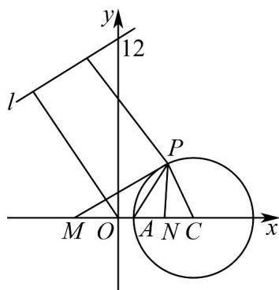

> [!faq]- 《专题09 直线与圆及圆与圆的位置关系高频题型精准突破（九大题型）（高效培优期末专项训练）》官方解析
>
> > [!success]- **【答案】** A. 原点 $O$ 到直线 $l$ 的距离的最大值为 12 B. $\triangle PMA$ 面积的最大值为 8 C. 点 $P$ 到 $l$ 距离的最大值为 17 D. $\sin\angle PMN$ 的最大值为 $\frac{1}{3}$
>
> > [!note]- **【分析】**
> > 先根据题设求出点 $P$ 的轨迹方程为 $\left(x - 5\right)^2 + y^2 = 16$ ，可得点 $P$ 的轨迹是圆，且圆心为 $C(5,0)$ ，半径 $r = 4$ ，再利用直线 $l$ 恒过定点，当直线 $l$ 与过点 $O$ 和 $(0,12)$ 的直线垂直时，原点 $O$ 到直线 $l$ 的距离最大即可求解 $^A$ ；根据面积公式即可求解 $^B$ ；利用直线恒过定点，当直线 $l$ 与过 $C(5,0)$ 和 $(0,12)$ 的直线垂直时，点 $P$ 到直线 $l$ 的距离最大即可求解 $^C$ ；对于 $^D$ ，根据直线 $PM$ 与圆 $C$ 相切时， $\angle PMN$ 最大，此时 $PM \perp PC$ ，在直角三角形中计算 $\sin \angle PMN$ 。
>
> > [!note]- **【解析】**
> > 设 $P(x,y)$ ，由 $\left|PM\right| = 2\left|PN\right|$ ，得 $\sqrt{(x + 3)^2 + y^2} = 2\sqrt{(x - 3)^2 + y^2}$ 即 $(x - 5)^2 +y^2 = 16$ ，则点 $P$ 的轨迹是圆，且圆心为 $C(5,0)$ ，半径 $r = 4\cdot$ 对于 $^{A}$ ，由于l恒过定点 $(0,12)$ ，而原点O和 $(0,12)$ 之间的距离为 $^{12}$ ，
> >
> > 当直线 l 与过点 O 和 $(0,12)$ 的直线垂直时，
> >
> > 原点 $O$ 到直线 $l$ 的距离最大，最大值为 $^{12}$ ，故 ${}^{\mathrm{A}}$ 正确；
> >
> > 对于 B，P 在圆 $(x-5)^{2}+y^{2}=16$ 上运动，其圆心 $C(5,0)$ 在 x 轴上，
> >
> > 则 $\triangle PMA$ 面积的最大值为 $\frac{1}{2} |MA| \times r = \frac{1}{2} \times 4 \times 4 = 8$ ，故 $^B$ 正确；
> >
> > 对于 $C$ ，由于 $l$ 恒过定点 $(0,12)$ ， $C(5,0)$ 和 $(0,12)$ 之间的距离为 $^{13}$
> >
> > 当直线 l 与过点 $C(5,0)$ 和 $(0,12)$ 的直线垂直时，
> >
> > 点 P 到直线 l 的距离最大，最大距离为 $13 + r = 17$ ，故 C 正确；
> >
> > 对于 $^{D}$ ，当直线 PM 与圆 C 相切时， $\angle PMN$ 最大，此时 $PM \perp PC$ ，
> >
> > 易知 $\left|MC\right|=3+5=8$ ， $\left|PC\right|=4$ ，则 $\sin\angle PMN=\frac{\left|PC\right|}{\left|MC\right|}=\frac{1}{2}$ ，故D错误.
> >
> > 故选：ABC.
> >
> > 
