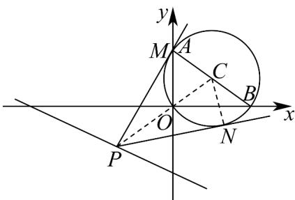

> [!faq]- 《专题09 直线与圆及圆与圆的位置关系高频题型精准突破（九大题型）（高效培优期末专项训练）》官方解析
>
> > [!success]- **【答案】** (1) $(x-4)^{2}+(y-3)^{2}=25$ ； (2) $\frac{4}{3}$ .
>
> > [!note]- **【分析】**
> > （1）利用直角三角形的外接圆圆心为斜边中点和半径为斜边一半即可写出圆的标准方程；
> >
> > (2) 把角度的最值问题转化为圆心到直线的距离问题，再利用二倍角公式，从而可求角的三角函数值。
>
> > [!note]- **【解析】**
> > （1）由三点 $O(0,0)$ ， $A(0,6)$ ， $B(8,0)$ ，可知 $OA \perp OB$ ，
> >
> > 所以VAOB是直角三角形，即它的外心在斜边的中点上，AB的中点坐标为 $(4,3)$ ，
> >
> > 它的外接圆半径为 $\frac{|AB|}{2}=5$ ，
> >
> > 所以经过 O, A, B 三点的圆 C 的标准方程为 $(x - 4)^{2} + (y - 3)^{2} = 25$ ;
> >
> > (2)
> >
> > 
> >
> > 直线 $l: x + 2y + 15 = 0$ 上有一个动点 $P$ ，圆 $C$ 上有两个不同的动点 $M, N$
> >
> > 当 $\angle MPN$ 为最大角时，满足 $PM, PN$ 与圆相切，
> >
> > 此时 $\sin\angle CPN=\frac{|CN|}{|CP|}=\frac{5}{|CP|}$ ，且 $\angle MPN=2\angle CPN$ ，
> >
> > 要使得 $\angle CPN$ 为最大角，根据正弦函数的单调性，则只需要 $|CP|$ 取得最小值，
> >
> > 而 $\left|CP\right|_{\min}=\frac{\left|4+2\times3+15\right|}{\sqrt{1+4}}=\frac{25}{\sqrt{5}}=5\sqrt{5}$
> >
> > 所以此时 $\sin \angle CPN = \frac{\sqrt{5}}{5}$ ，则有 $\cos \angle CPN = \frac{2\sqrt{5}}{5}$ ，即 $\tan \angle CPN = \frac{1}{2}$
> >
> > 所以 $\tan\angle MPN = \tan2\angle CPN = \frac{2 \times \frac{1}{2}}{1 - \frac{1}{4}} = \frac{4}{3}$
