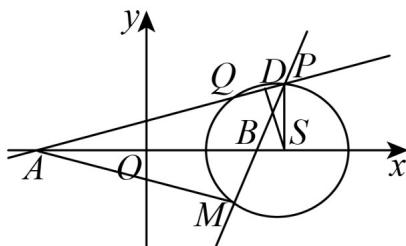
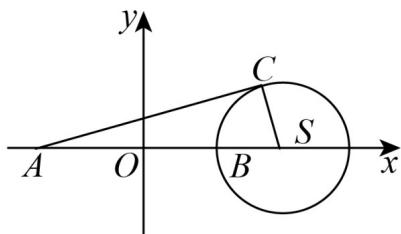

> [!faq]- 《专题09 直线与圆及圆与圆的位置关系高频题型精准突破（九大题型）（高效培优期末专项训练）》官方解析
>
> > [!success]- **【答案】** A． $\triangle PAB$ 的面积的最大值为 12 B. $Q$ ， $M$ 关于 $x$ 轴对称 C. 当 $\angle PMQ = \frac{\pi}{3}$ 时， $|PQ| = 2\sqrt{3}$ D．直线 $_{AC}$ 的斜率的取值范围为 $\left[-\frac{\sqrt{2}}{4},\frac{\sqrt{2}}{4}\right]$
>
> > [!note]- **【分析】**
> > 利用给定定义得到 $C$ 的轨迹并结合三角形面积公式判断 $\mathsf{A}$ ，利用角平分线定理逆定理结合对称性判断 $\mathsf{B}$ ，利用圆周角和圆心角以及垂径定理判断 $\mathsf{C}$ ，先求出直线和圆相切时的斜率情况，再求解取值范围判断 $\mathsf{D}$ 即可·
>
> > [!note]- **【解析】**
> > 设 $C(x,y)$ ，由 $\left|CA\right|=3\left|CB\right|$ 可得，
> >
> > $\sqrt{(x + 4)^2 + y^2} = 3\sqrt{(x - 4)^2 + y^2}$ ，即 $(x - 5)^2 +y^2 = 9$
> >
> > 所以 C 的轨迹 $\Omega$ 是以 $(5,0)$ 为圆心， $^{3}$ 为半径的圆，记圆 $\Omega$ 的圆心为 S，半径为 r。
> >
> > 对于 A 选项， $\left(S_{\triangle PAB}\right)_{\max}=\frac{1}{2}\left|AB\right|r=\frac{1}{2}\times8\times3=12$ ，选项 A 正确；
> >
> > 对于 $^{B}$ 选项，如图，圆Ω关于x轴对称， $A(-4,0)$ ， $B(4,0)$ 在x轴上，
> >
> > 直线 $AP$ 与圆 $\Omega$ 交于 $P$ ， $Q$ 两点，直线 $BP$ 与圆 $\Omega$ 交于 $P$ ， $M$ 两点，
> >
> > 
> >
> > 由题可知 $\left|PA\right|=3\left|PB\right|$ ， $\left|MA\right|=3\left|MB\right|$ ，
> >
> > 由角分线定理逆定理得 $\frac{|PA|}{|PB|} = \frac{|MA|}{|MB|} = 3$ ，故 $\angle PAB = \angle MAB$ ，
> >
> > 又根据圆的对称性可知，Q，M 关于 x 轴对称，选项 B 正确；
> >
> > 对于 $C$ 选项，当 $\angle PMQ = \frac{\pi}{3}$ 时， $\angle PSQ = \frac{2\pi}{3}$
> >
> > 而 $|SQ|=|SP|=3$ ，则 $\triangle PSQ$ 为等腰三角形，
> >
> > 过 $\mathrm{S}$ 作 $SD\perp PQ$ 于 $D$ ，则 $\angle PSD = \frac{1}{2}\angle PSQ = \frac{\pi}{3}$
> >
> > 则 $\left|PD\right|=3\times\frac{\sqrt{3}}{2}=\frac{3\sqrt{3}}{2}$ ，由垂径定理可得 $\left|PQ\right|=2\left|PD\right|=3\sqrt{3}$ ，选项C错误；
> >
> > 对于 $^{D}$ 选项，当直线AC与圆Ω相切时，连接SC，
> >
> > 
> >
> > 得到 $AC \perp SC$ ，此时 $\left|AS\right| = 9$ ， $\left|CS\right| = 3$ ，由勾股定理得 $\left|AC\right| = 6\sqrt{2}$
> >
> > 由锐角三角函数的定义得 $\tan\angle CAS=\frac{3}{6\sqrt{2}}=\frac{\sqrt{2}}{4}$
> >
> > 由斜率的几何意义得此时直线 $AC$ 的斜率为 $\frac{\sqrt{2}}{4}$ ，根据圆的对称性可知，
> >
> > 得到直线 $AC$ 斜率的取值范围为 $\left[-\frac{\sqrt{2}}{4}, \frac{\sqrt{2}}{4}\right]$ ，选项D正确。
> >
> > 故选：ABD
> >
> > 11. 圆 $(x - 1)^2 + (y - 1)^2 = 1$ 上的点到直线 $x - y - 2 = 0$ 距离的最小值是（）A. $\sqrt{2} - 1$ B. 1 C. $\sqrt{2}$ D. $\sqrt{2} + 1$
> >
> > 【答案】A
> >
> > 【分析】根据圆的标准方程确定圆心和半径，再根据直线方程，利用点到直线的距离公式，计算出圆心到直线的距离 $d$ ，根据 $d$ 、 $r$ 的大小关系，得出直线和圆不相交，从而得出距离的最小值为 $d - r$
> >
> > 【详解】已知圆的标准方程为： $(x-1)^{2}+(y-1)^{2}=1$ ，则其圆心 $O(1,1)$ ，半径r=1。
> >
> > 直线方程为 $x - y - 2 = 0$ ，根据点到直线的距离公式计算圆心到直线的距离为：
> >
> > $$
> > d = \frac {\left| 1 \times 1 + (- 1) \times 1 - 2 \right|}{\sqrt {1 ^ {2} + (- 1) ^ {2}}} = \sqrt {2}
> > $$
> >
> > 因为 $d = \sqrt{2} > 1 = r$ ，那么圆与直线相离。
> >
> > 因此，圆上点到直线的最小距离为圆心到直线的距离减去半径，即： $d - r = \sqrt{2} - 1$
> >
> > 故选 **A**.
