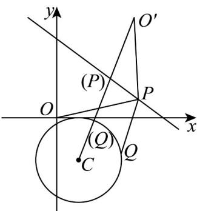

> [!faq]- 《专题09 直线与圆及圆与圆的位置关系高频题型精准突破（九大题型）（高效培优期末专项训练）》官方解析
>
> > [!success]- **【答案】** ACD
>
> > [!note]- **【分析】**
> > 利用圆心到直线的距离判断 $^{A}$ ，作点 O 关于直线的对称点 $O'$ ，结合点与圆的位置关系利用几何法求解最小值判断 $^{B}$ ，求出圆心 C 到直线 l 的距离 d，利用辅助角公式化简并利用正弦函数的性质求得 $d \in [0,3]$ ，与半径比较即可判断 $^{C}$ ，举例法当 $\lambda = 1$ 时，求出圆心到直线的距离等于半径，即可判断 $^{D}$ .
>
> > [!note]- **【解析】**
> > 对于 $^{AB}$ ，当 $\cos\theta=\frac{3}{5}$ ， $\lambda=-1$ 时，直线 $l:(x+1)\cdot\frac{3}{5}+(y-2)\cdot\frac{4}{5}=2$ 即 $3x+4y-15=0$ ，
> > 圆 $C: x^{2} + y^{2} - 2x + 4y + 1 = 0$ 即 $(x-1)^{2} + (y+2)^{2} = 4$ ，圆心 $C(1,-2)$ ，半径为r=2，
> > 则圆心 C 到直线 l 的距离为 $\frac{|3-8-15|}{\sqrt{3^{2}+4^{2}}} = 4$ ，故 A 正确；
> >
> > 
> >
> > 如图作点 O 关于直线的对称点，设，则 $\left\{\begin{aligned}\frac{n}{m}\times\left(-\frac{3}{4}\right)=-1\\3\times\frac{m}{2}+4\times\frac{n}{2}-15=0\end{aligned}\right.$
> >
> > 解得 $\left\{ \begin{array}{l} m = \frac{18}{5} \\ n = \frac{24}{5} \end{array} \right.$ ，所以 $O^{\prime}\left(\frac{18}{5}, \frac{24}{5}\right)$ ，则 $|OP| + |QP| = |O^{\prime}P| + |QP| \quad |O^{\prime}Q| \quad |O^{\prime}C| - r = \sqrt{53} - 2$
> >
> > 所以 $\left|OP\right|+\left|QP\right|$ 的最小值为 $\sqrt{53}-2$ ，故 $^{B}$ 错误；
> >
> > 当 $\lambda=2$ 时，圆 $C:x^{2}+y^{2}+4x-8y+4=0$ 即 $(x+2)^{2}+(y-4)^{2}=16$
> >
> > 圆心 $C(-2,4)$ ，半径为 r=4，
> >
> > 圆心 $C$ 到直线 $l$ 的距离为 $d = \frac{|-\cos\theta + 2\sin\theta - 2|}{\sqrt{\cos^2\theta + \sin^2\theta}} = |-\cos\theta + 2\sin\theta - 2|$ ，
> >
> > $-\cos \theta + 2 \sin \theta = \sqrt{5} \sin (\theta - \varphi)$ ，其中 $\sin \varphi = \frac{\sqrt{5}}{5}, \cos \varphi = \frac{2\sqrt{5}}{5}$
> >
> > 因为 $\theta \in [0,\pi ]$ ，所以 $\theta -\varphi \in [-\varphi ,\pi -\varphi ]$ ，所以 $\sin (\theta -\varphi)\in \left[-\frac{\sqrt{5}}{5},1\right]$
> >
> > 所以 $-\cos \theta + 2\sin \theta - 2 \in [-3, \sqrt{5} - 2]$ ，所以 $d = |- \cos \theta + 2\sin \theta - 2| \in [0, 3]$ ，
> >
> > 所以任意的 $\theta\in[0,\pi]$ ，d<r，
> >
> > 故当 $\lambda = 2$ 时，任意的 $\theta \in [0,\pi ]$ ，使圆 $C$ 与直线 $l$ 相交，故 $C$ 正确；
> >
> > 当 $\lambda = 1$ 时，圆 $C: x^2 + y^2 + 2x - 4y + 1 = 0$ 即 $(x + 1)^2 + (y - 2)^2 = 4$
> >
> > 圆心 $C(-1,2)$ ，半径为 $r = 2$ ，圆心 $C$ 到直线 $l$ 的距离为 $d = \frac{|-2|}{\sqrt{\cos^2\theta + \sin^2\theta}} = 2 = r$
> >
> > 故当 $\lambda=1$ 时，对任意的 $\theta\in[0,\pi]$ ，圆 C 与直线 l 均相切，故 D 正确.
> >
> > 故选 **ACD**
