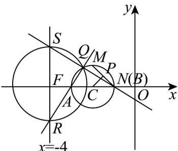

> [!faq]- 《专题09 直线与圆及圆与圆的位置关系高频题型精准突破（九大题型）（高效培优期末专项训练）》官方解析
>
> > [!success]- **【答案】** BD
>
> > [!note]- **【分析】**
> > 确定直线 OP 的方程，联立直线方程解出 P 点坐标，利用垂径定理及两直线垂直的斜率关系计算 a 判断 A；根据点到直线的距离公式、弦长公式判断 BC；设 QA 方程，含参表示 QB 方程，求出 R, S 坐标，从而求出以 RS 为直径的圆的方程，利用待定系数法计算即可.
>
> > [!note]- **【解析】**
> > 如图
> >
> > 
> >
> > 选项 A：由题知直线 的方程为 $y = -\frac{1}{3}x$ ，则由 $\left\{\begin{aligned}y &= -x - 1 \\ y &= -\frac{1}{3}x\end{aligned}\right.$ ，得 $\left\{\begin{aligned}x &= -\frac{3}{2}\\ y &= \frac{1}{2}\end{aligned}\right.$ ，即 $P\left(-\frac{3}{2}, \frac{1}{2}\right)$ ，
> >
> > 因为点 为线段 的中点，所以 $k_{MN} \cdot k_{PC} = -1 \times \frac{0 - \frac{1}{2}}{a + \frac{3}{2}} = -1$ ，所以 $a = -2$ 故A错误；
> >
> > 选项 B：由 a = -2 ，得圆心 $C(-2,0)$ ，所以 C 到直线 $x + y + 1 = 0$ 距离为 $d = \frac{1}{\sqrt{2}} = \frac{\sqrt{2}}{2}$ ，所以
> >
> > $\left|M N\right| = 2 \sqrt{1 - \left(\frac{\sqrt{2}}{2}\right)^2} = \sqrt{2}$ ，故 B 正确；
> >
> > 选项 C：因为 O 到直线 $x + y + 1 = 0$ 的距离为 $\frac{\sqrt{2}}{2}$ ，MN 的长度为 $\sqrt{2}$ ，所以 $S_{\Delta MON} = \frac{1}{2} \times \frac{\sqrt{2}}{2} \times \sqrt{2} = \frac{1}{2}$ ，故 C 错
> >
> > 误；
> >
> > 选项 D：由圆 C 与 x 轴交于 A, B 两点，得 $A(-3,0)$ ， $B(-1,0)$
> >
> > 不妨设直线 $QA$ 的方程为 $y = k(x + 3)$ ，其中 $k \neq 0$ ，在直线 $QA$ 的方程中，令 $x = -4$ ，可得 $R(-4, -k)$ ，因为 $QA \perp QB$ ，则直线 $QB$ 的方程为 $y = -\frac{1}{k}(x + 1)$ ，直线 $QB$ 的方程中，令 $x = -4$ ，可得 $y = \frac{3}{k}$ ，即点 $S\left(-4, \frac{3}{k}\right)$ ，
> >
> > 设线段 $RS$ 的中点为 $F$ ，则 $F\left(-4, \frac{3 - k^2}{2k}\right)$ ，圆的半径的平方为 $\left(\frac{k^2 + 3}{2k}\right)^2$ ，
> >
> > 所以以线段 $RS$ 为直径的圆的方程为 $\left(x + 4\right)^2 +\left(y - \frac{3 - k^2}{2k}\right)^2 = \left(\frac{k^2 + 3}{2k}\right)^2$ ，即 $\left(x + 4\right)^2 +y^2 -\frac{3 - k^2}{k} y - 3 = 0$ 由 $\left\{ \begin{array}{l}(x + 4)^2 -3 = 0\\ y = 0\\ -3 <   x <   - 1 \end{array} \right.$ ，解得 $\left\{ \begin{array}{ll}x = -4 + \sqrt{3}\\ y = 0 \end{array} \right.$ ，因此，当点变化时，以为直径的圆恒过圆 $C$ 内的定点 $\left(-4 + \sqrt{3},0\right)$ ，故D正确；
> >
> > 故选 **BD**
