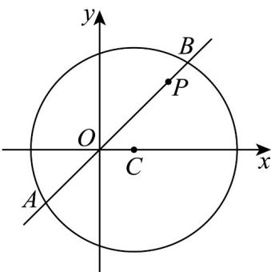

> [!faq]- 《专题09 直线与圆及圆与圆的位置关系高频题型精准突破（九大题型）（高效培优期末专项训练）》官方解析
>
> > [!success]- **【答案】** (1)2x-y-2=0 (2) $\sqrt{34}$
>
> > [!note]- **【分析】**
> > （ $^{1}$ ）先利用圆的标准方程得出圆心和半径，利用两点求出斜率，根据点斜式求出直线方程；
> >
> > (2) 先利用倾斜角求出直线斜率，进而运用点斜式求出直线方程，再利用点到直线的距离公式求出圆心到直线的距离，最后利用弦长公式求出 $|AB|$ .
>
> > [!note]- **【解析】**
> > （1）∵圆C的标准方程为 $(x-1)^{2}+y^{2}=9$
> >
> > ∴圆心为 $C(1,0)$ ，半径 r=3
> >
> > $\therefore$ 直线过点 $P$ 、 $C$ ， $\therefore$ 直线 $l$ 的斜率 $k_{PC} = \frac{0 - 2}{1 - 2} = 2$
> >
> > (2)
> >
> > ∴直线 l 的方程为 $y = 2(x - 1)$ ，即 2x - y - 2 = 0
> >
> > 
> >
> > 当直线 $l$ 的倾斜角为 $45^{\circ}$ 时，斜率 $k = \tan 45^{\circ} = 1$
> >
> > ∴直线 l 的方程为 y-2=x-2，即 x-y=0
> >
> > 圆心 到直线 的距离 $d=\frac{|1-0|}{\sqrt{1^{2}+(-1)^{2}}}=\frac{1}{\sqrt{2}}=\frac{\sqrt{2}}{2}$ ，圆 C 的半径为 r=3，
> >
> > 弦 $AB$ 的长为： $\left|AB\right| = 2\sqrt{r^2 - d^2} = 2\sqrt{9 - \frac{1}{2}} = \sqrt{34}$
