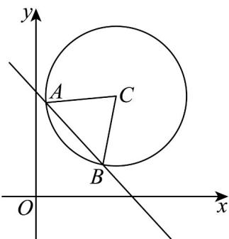

> [!faq]- 《专题09 直线与圆及圆与圆的位置关系高频题型精准突破（九大题型）（高效培优期末专项训练）》官方解析
>
> > [!success]- **【答案】** A. 直线 $l$ 过定点 $(2,3)$ B. 当 $|AB|$ 取得最小值时， $m = 1$ C. 当 $\angle ACB$ 最小时，其余弦值为 $\frac{1}{3}$ D. $AB \cdot AC$ 的最大值为 24
>
> > [!note]- **【分析】**
> > $^{A}$ 令x-2=0可得； $^{BC}$ 根据直线l与过点 $C(4,5)$ 和 $(2,3)$ 的直线垂直判断； $^{D}$ 利用数量积的几何意义求出·
>
> > [!note]- **【解析】**
> > 对于 A：由 $mx - y - 2m + 3 = 0$ 有 $m(x - 2) - y + 3 = 0$
> >
> > 令 $x - 2 = 0$ 有 $-y + 3 = 0$ ，所以 $\left\{ \begin{array}{l} x = 2 \\ y = 3 \end{array} \right.$ ，所以直线 $l$ 过定点 $(2,3)$ ，故 ${}^{\mathrm{A}}$ 正确；
> >
> > 对于 B：点 $(2,3)$ 在圆 C 内，圆 C 的圆心为 $C(4,5)$ ，
> >
> > 当 $|AB|$ 取得最小值时，直线l与过点 $C(4,5)$ 和 $(2,3)$ 的直线垂直，
> >
> > 所以 $m \cdot \frac{5 - 3}{4 - 2} = -1$ ，解得 $m = -1$ ，故 $\mathsf{B}$ 错误；
> >
> > 对于 $C$ ：当 $\angle ACB$ 最小时，此时 $\left|AB\right|$ 最小，
> >
> > 则 $|AB|=2\sqrt{12-(4-2)^{2}-(5-3)^{2}}=4$
> >
> > 由余弦定理有 $\cos \angle ACB = \frac{BC^2 + AC^2 - AB^2}{2BC\cdot AC} = \frac{12 + 12 - 16}{2\times 12} = \frac{1}{3}$ ，故C正确；
> >
> > 对于 D： $AB \cdot AC = |AB||AC| \cos \left\langle AB, AC \right\rangle = \frac{\left|AB\right|^2}{2} \leq \frac{(4\sqrt{3})^2}{2} = 24$
> >
> > 即 $AB \cdot AC$ 的最大值为 $24$ ，故 $D$ 正确.
> >
> > 
> >
> > 故选 **ACD**.
