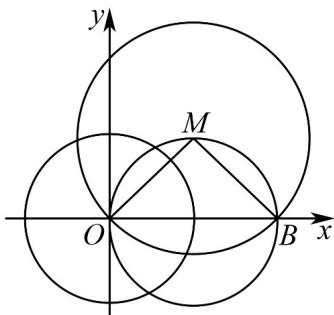

> [!faq]- 《专题09 直线与圆及圆与圆的位置关系高频题型精准突破（九大题型）（高效培优期末专项训练）》官方解析
>
> > [!success]- **【答案】** $\frac{\pi}{2}$
>
> > [!note]- **【分析】**
> > 根据题意可得圆 $N$ 必经过原点 $(0,0)$ ，圆 $M$ 与圆 $N$ 的相交弦刚好是圆 $N$ 的直径时， $|AB|$ 最大，进一步求解即可·
>
> > [!note]- **【解析】**
> > 圆 $N$ 是以圆 $x^{2} + y^{2} = 1$ 上一点为圆心，
> >
> > 所以圆 N 必经过原点 $(0,0)$ ,
> >
> > 又因为圆 $M(x-1)^{2}+(y-1)^{2}=2$ 经过原点，
> >
> > 所以圆 M 与圆 N 交于原点，设为 A .
> >
> > 当圆 $M$ 与圆 $N$ 的相交弦刚好是圆 $N$ 的直径时， $\left|AB\right|$ 最大，
> >
> > 此时 $\left|AB\right|=2$ ， $B(20)$ ，而 $M(11)$
> >
> > 所以 $\angle AMB = \frac{\pi}{2}$
> >
> > 
> >
> > 故答案为： $\frac{\pi}{2}$
