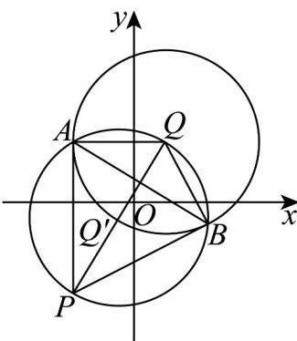

> [!faq]- 《专题09 直线与圆及圆与圆的位置关系高频题型精准突破（九大题型）（高效培优期末专项训练）》官方解析
>
> > [!success]- **【答案】** (1) $\left(x+\frac{1}{2}\right)^{2}+\left(y+\frac{1}{2}\right)^{2}=\frac{17}{2}$ (2)是，理由见解析； (3) $3x + 5y - 4 = 0$
>
> > [!note]- **【分析】**
> > （1）利用圆的标准方程得出圆心坐标，结合两点距离公式、中点坐标公式计算即可；
> >
> > (2) 根据直径所对的圆周角为直角，及切线的性质判定即可；
> >
> > (3) 直接对两圆的方程作差即可得出公共弦方程.
>
> > [!note]- **【解析】**
> > （1）易知 $Q(1,2)$ ， $|PQ|=\sqrt{(-2-1)^{2}+(-3-2)^{2}}=\sqrt{34}$ ，
> >
> > $Q'$ 的坐标为 $\left(\frac{-2+1}{2}, \frac{-3+2}{2}\right)=\left(-\frac{1}{2}, -\frac{1}{2}\right)$
> >
> > 所以圆 $Q'$ 的方程为 $\left(x + \frac{1}{2}\right)^2 +\left(y + \frac{1}{2}\right)^2 = \left(\frac{\sqrt{34}}{2}\right)^2 = \frac{17}{2}$
> >
> > 即 $\left(x+\frac{1}{2}\right)^{2}+\left(y+\frac{1}{2}\right)^{2}=\frac{17}{2}$ ;
> >
> > (2) 是切线，理由如下：
> >
> > 因为 PQ 是圆 $Q'$ 的直径，则 $\angle QAP = \angle QBP = 90^{\circ}$ ，
> >
> > 即 $QA \perp PA, QB \perp PB$ ，所以直线PA，PB是圆Q的切线；
> >
> > (3) 由 $\left(x - 1\right)^2 + \left(y - 2\right)^2 = 9 \Rightarrow x^2 - 2x + y^2 - 4y - 4 = 0$
> >
> > $$
> > \left(x + \frac {1}{2}\right) ^ {2} + \left(y + \frac {1}{2}\right) ^ {2} = \frac {1 7}{2} \Rightarrow x ^ {2} + x + y ^ {2} + y - 8 = 0,
> > $$
> >
> > 两圆方程作差有 $3x + 5y - 4 = 0$
> >
> > 即公共弦 AB 的方程为 $3x + 5y - 4 = 0$ .
> >
> > 
