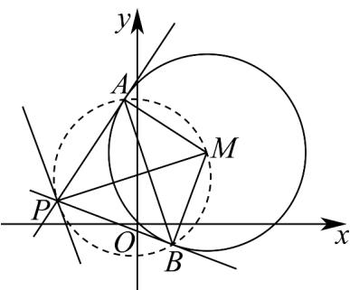
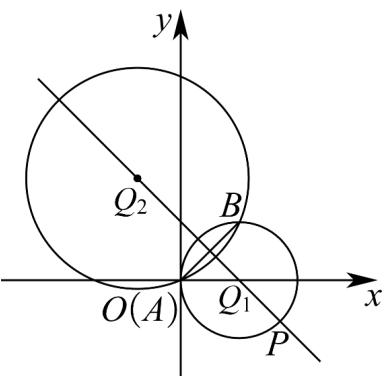

> [!faq]- 《专题09 直线与圆及圆与圆的位置关系高频题型精准突破（九大题型）（高效培优期末专项训练）》官方解析
>
> > [!success]- **【答案】** A. $2x + y - 1 = 0$ B. $2x - y - 1 = 0$ C. $2x - y + 1 = 0$ D. $2x + y + 1 = 0$
>
> > [!note]- **【分析】**
> > 由题意直线与圆相离，根据圆的性质知 $A, P, B, M$ 共圆且 $AB \perp MP$ ，根据
> >
> > $\left|PM\right|\cdot \left|AB\right| = 4S_{\triangle PAM} = 2\sqrt{2}\left|PA\right|$ 知，当直线 $MP\perp l$ 时 $\left|PM\right|\cdot \left|AB\right|$ 最小，求出以 $MP$ 为直径的圆的方程，即可求出直线 $AB$ 的方程：
>
> > [!note]- **【解析】**
> > 由题设 $\odot M:(x - 1)^2 +(y - 1)^2 = 2$ ，点 $M$ 到直线 $l$ 的距离 $d = \frac{|2\times 1 + 1 + 2|}{\sqrt{2^2 + 1^2}} = \sqrt{5} >\sqrt{2}$
> >
> > 
> >
> > 又 $PA, PB$ 为圆 $M$ 的切线， $A, B$ 为切点，则 $A, P, B, M$ 四点共圆，且 $AB \perp MP$ 所以 $\left|PM\right| \cdot \left|AB\right| = 4S_{\triangle PAM} = 4 \times \frac{1}{2} \times \left|PA\right| \times \left|AM\right| = 2\sqrt{2}\left|PA\right|$ ，而 $\left|PA\right| = \sqrt{\left|MP\right|^2 - 2}$ ，当直线 $MP \perp l$ 时 $\left|MP\right|_{\min} = \sqrt{5}$ ， $\left|PA\right|_{\min} = \sqrt{3}$ ，此时 $\left|PM\right| \cdot \left|AB\right|$ 最小，而 $k_l = -2$ ，则 $k_{MP} = \frac{1}{2}$ ，故 $MP: y - 1 = \frac{1}{2}(x - 1)$ ，即 $y = \frac{1}{2} x + \frac{1}{2}$ ，
> >
> > 由 $\left\{ \begin{array}{l} y = \frac{1}{2} x + \frac{1}{2} \\ 2x + y + 2 = 0 \end{array} \right.$ ，解得 $\left\{ \begin{array}{l} x = -1 \\ y = 0 \end{array} \right.$ ，此时 $P(-1,0)$ ，
> >
> > 以 $MP$ 为直径的圆的圆心为 $(0, \frac{1}{2})$ ，半径为 $\frac{\sqrt{5}}{2}$ ，所以 $x^{2} + (y - \frac{1}{2})^{2} = \frac{5}{4}$ ，即 $x^{2} + y^{2} - y - 1 = 0$ ，两圆的方程相减可得 $2x + y - 1 = 0$ ，即为直线 $AB$ 的方程。
> >
> > 故选：A
> >
> > 47. 圆 $Q_{1}: x^{2} + y^{2} - 2x = 0$ 和圆 $Q_{2}: x^{2} + y^{2} + 2x - 4y = 0$ 的交点为 $A, B$ ，则（）A．直线 $AB$ 的方程为 $x - y = 0$ B．线段 $AB$ 的垂直平分线方程为 $x + y - 1 = 0$ C．弦 $_{AB}$ 的长为 $\frac{\sqrt{2}}{2}$ D． $P$ 为圆 $Q_{1}$ 上一动点，则 $P$ 到直线 $_{AB}$ 距离的最大值为 $\frac{\sqrt{2}}{2} + 1$
> >
> > 【答案】ABD
> >
> > 【分析】对于 $^{A}$ 选项：两圆方程作差即可求出公共弦方程；对于 $^{B}$ 选项：线段AB的垂直平分线即为两圆圆心的连线，利用点斜式求解即可；对于 $^{C}$ 选项：求出圆 $Q_{1}$ 的圆心到公共弦的距离，利用弦长公式计算即可；对于 $^{D}$ 选项：求出圆 $Q_{1}$ 的圆心到公共弦的距离，加上半径即可求出最大值。
> >
> > 【详解】对于 A 选项：圆 $Q_{1}: x^{2} + y^{2} - 2x = 0$ 和圆 $Q_{2}: x^{2} + y^{2} + 2x - 4y = 0$
> >
> > 将两圆的方程作差得 4x - 4y = 0 ，即 x - y = 0
> >
> > 所以直线 AB 的方程为 x - y = 0 ，故 A 正确；
> >
> > 对于 B 选项：圆 $Q_{1}: x^{2} + y^{2} - 2x = 0$ 即 $(x - 1)^{2} + y^{2} = 1$ ，圆心 $Q_{1}(1,0)$ ，半径 $r_{1} = 1$ ，
> >
> > 圆 $Q_{2}:x^{2} + y^{2} + 2x - 4y = 0$ 即 $\left(x + 1\right)^{2} + \left(y - 2\right)^{2} = 5$ ，圆心 $Q_{2}(-1,2)$
> >
> > 直线 $Q_{1}Q_{2}$ 的斜率为 $\frac{2 - 0}{-1 - 1} = -1$ ，即线段 $AB$ 的垂直平分线的斜率为 $-1$
> >
> > 所以线段 $AB$ 的垂直平分线方程为 $y - 0 = -(x - 1)$ ，即 $x + y - 1 = 0$ ，故 ${}^{\mathrm{B}}$ 正确；
> >
> > 对于 C 选项： $Q_{1}(1,0)$ 到直线 AB: x - y = 0 的距离 $d = \frac{1}{\sqrt{1^{2} + 1^{2}}} = \frac{\sqrt{2}}{2}$
> >
> > 可得弦 $_{AB}$ 的长为 $2\sqrt{r_{1}^{2}-d^{2}}=2\sqrt{1-\frac{1}{2}}=\sqrt{2}$ ，故C错误；
> >
> > 对于 $\mathbf{D}$ 选项： $P$ 到直线 $AB$ 的距离的最大值为 $d + r_{1} = \frac{\sqrt{2}}{2} +1$ ，故 $\mathbf{D}$ 正确.
> >
> > 故选：ABD
> >
> > 
