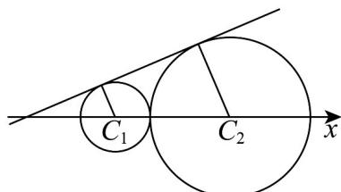

> [!faq]- 《专题09 直线与圆及圆与圆的位置关系高频题型精准突破（九大题型）（高效培优期末专项训练）》官方解析
>
> > [!success]- **【答案】** D
>
> > [!note]- **【分析】**
> > 设两圆心 $C_1(a,0), C_2(b,0), -3 < a < b$ ，由圆心到切线距离等于半径求出 $r_1, r_2$ ，再结合 $\left|C_1C_2\right| = b - a = r_1 + r_2$ 求出 $b = 3a + 6$ 即可计算 $\frac{r_2}{r_1}$ .
>
> > [!note]- **【解析】**
> > 两圆的一条公切线的方程为 $y=\frac{\sqrt{3}}{3}(x+3)$ 即 $x-\sqrt{3}y+3=0$ 过点 $(-3,0)$ ，不妨设两圆心 $C_{1}(a,0), C_{2}(b,0), -3 < a < b$ ，则 $(x-a)^{2} + y^{2} = r_{1}^{2}, (x-b)^{2} + y^{2} = r_{2}^{2}$
> >
> > 
> >
> > 则 $r_1 = \frac{a + 3}{2}, r_2 = \frac{b + 3}{2}$ ， $\left|C_1C_2\right| = b - a = r_1 + r_2 = \frac{a + 3}{2} + \frac{b + 3}{2} = \frac{a + b}{2} + 3 \Rightarrow b = 3a + 6$ ，则 $\frac{r_1}{r_2} = \frac{\frac{a + 3}{2}}{\frac{b + 3}{2}} = \frac{a + 3}{b + 3} = \frac{a + 3}{3a + 9} = \frac{1}{3}$ ，故 $\frac{r_2}{r_1} = 3$ 。
> >
> > 故选 **D**
