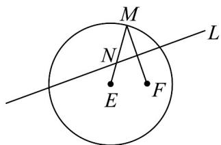

<!-- question-source:start -->
22. 如图，圆 $E$ 的圆心为 $E\left(-\sqrt{3}0\right)$ ，半径为 4， $F\left(\sqrt{3}0\right)$ 是圆 $E$ 内一个定点， $M$ 是圆 $E$ 上任意一点·线段 $FM$ 的垂直平分线 $L$ 和半径 $EM$ 相交于点 $N$ ，当点 $M$ 在圆上运动时，记动点 $N$ 的轨迹为曲线 $C$ .

(1)求曲线 C 的方程;

(2)设曲线 C 与 x 轴从左到右的交点为点 A, B，点 P 为曲线 C 上异于 A, B 的动点，设 PB 交直线 x = 4 于点 T，连结 AT 交曲线 C 于点 Q. 直线 AP、AQ 的斜率分别为 $k_{AP}$ 、 $k_{AQ}$ .

(i) 求证： $k_{AP} \cdot k_{AQ}$ 为定值；

(ii) 证明直线 PQ 经过 x 轴上的定点，并求出该定点的坐标.
<!-- question-source:end -->

![[高中/课堂同步/题库/人教A版高中数学同步讲义(2026)/04_选择性必修第二册/期末/专题10 椭圆标准方程及其性质高频题型精准突破（九大题型）（高效培优期末专项训练）/专题10_椭圆标准方程及其性质_九大题型/questions/answers/Q00081289A1.md]]
