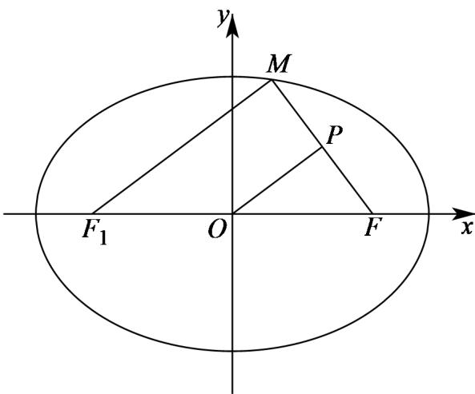

> [!faq]- 《专题10 椭圆标准方程及其性质高频题型精准突破（九大题型）（高效培优期末专项训练）》官方解析
>
> > [!success]- **【答案】** A
>
> > [!note]- **【分析】**
> > 记椭圆 C 的左焦点为 $F_{1}$ ，连接 $MF_{1}$ ，利用中位线的性质求出 $\left|MF_{1}\right|$ ，再利用椭圆的定义可求得 $\left|MF\right|$ .
>
> > [!note]- **【解析】**
> > 记椭圆 $C$ 的左焦点为 $F_{1}$ ，连接 $MF_{1}$
> >
> > 
> >
> > 又点 $P$ 是线段 $MF$ 的中点， $O$ 为 $FF_{1}$ 的中点，所以 $\left|OP\right| = \frac{1}{2}\left|MF_{1}\right|$
> >
> > 又 $\left|OP\right|=4$ ，所以 $\left|MF_{1}\right|=8$
> >
> > 在椭圆 $C:\frac{x^{2}}{49}+\frac{y^{2}}{24}=1$ 中，a=7，
> >
> > 又点 $M$ 是 $C$ 上的一点，所以 $\left|MF\right| + \left|MF_1\right| = 2a = 14$ ，所以 $\left|MF\right| = 6$
> >
> > 故选 **A**.
