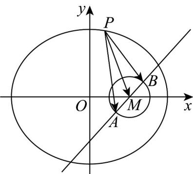

> [!faq]- 《专题10 椭圆标准方程及其性质高频题型精准突破（九大题型）（高效培优期末专项训练）》官方解析
>
> > [!success]- **【答案】** A
>
> > [!note]- **【分析】**
> > 根据圆心 $M$ 为 $AB$ 的中点，利用向量运算将 $\overline{PA} \cdot \overline{PB}$ 用 $\left| \overline{PM} \right|$ 来表示，转化为椭圆上一点到焦点的距离范围求解即可·
>
> > [!note]- **【解析】**
> > $\odot M:x^{2} + y^{2} - 4x + 3 = 0$ ，即 $(x - 2)^{2} + y^{2} = 1$ 的圆心 $M(2,0)$ ，半径为1，
> >
> > 椭圆方程 $C: \frac{x^2}{16} + \frac{y^2}{12} = 1$ 中， $a^2 = 16, b^2 = 12$ ， $c^2 = a^2 - b^2 = 16 - 12 = 4, c = 2$ ，
> >
> > 则圆心 $M(2,0)$ 为椭圆的右焦点，线段 $AB$ 为 $\odot M$ 的直径，连接 $PM$
> >
> > 因此 $PA \cdot PB = (PM + MA) \cdot (PM + MB) = (PM - MB) \cdot (PM + MB)$
> >
> > $= \left|\overline{PM}\right|^2 -\left|\overline{MB}\right|^2 = \left|\overline{PM}\right|^2 -1$ ，点 $P$ 为椭圆 $C:\frac{x^2}{16} +\frac{y^2}{12} = 1$ 上任意一点，
> >
> > 则 $\left|PM\right|_{\min} = a - c = 2$ ， $\left|PM\right|_{\max} = a + c = 6$ ，即 $2\leq \left|PM\right|\leq 6$
> >
> > 所以 $PA \cdot PB = \left| PM \right|^2 - 1 \in [3, 35]$ .
> >
> > 故选：A
> >
> > 
> >
> > ## 考点 03 焦点三角形周长面积问题
