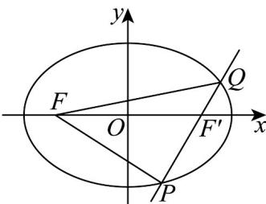

> [!faq]- 《专题10 椭圆标准方程及其性质高频题型精准突破（九大题型）（高效培优期末专项训练）》官方解析
>
> > [!success]- **【答案】** B
>
> > [!note]- **【分析】**
> > 结合椭圆的定义可得 $\triangle PQF$ 的周长为 $4a$ ，即可求解·
>
> > [!note]- **【解析】**
> > 由题可知： $a^2 = 8, b^2 = 4$ ，所以 $a = 2\sqrt{2}, b = 2$ ：
> >
> > 如图： $\left|PQ\right|+\left|PF\right|+\left|QF\right|=\left|PF'\right|+\left|QF'\right|+\left|PF\right|+\left|QF\right|=4a=8\sqrt{2}$
> >
> > 
> >
> > 所以 $\triangle PQF$ 的周长为 $8\sqrt{2}$
> >
> > 故选 **B**.
