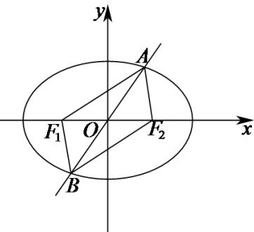

> [!faq]- 《专题10 椭圆标准方程及其性质高频题型精准突破（九大题型）（高效培优期末专项训练）》官方解析
>
> > [!success]- **【答案】** C
>
> > [!note]- **【分析】**
> > 由题意，根据椭圆的定义计算直接得出结果·
>
> > [!note]- **【解析】**
> > 由题意知， $a=2\sqrt{2}$ ，由椭圆的定义知，
> >
> > 四边形 $AF_{1}BF_{2}$ 的周长为 $\left|AF_{1}\right|+\left|AF_{2}\right|+\left|BF_{1}\right|+\left|BF_{2}\right|=4a=8\sqrt{2}$
> >
> > 故选：C
> >
> > 
