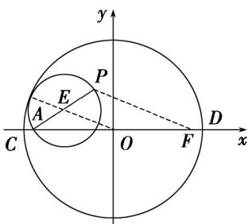

> [!faq]- 《专题10 椭圆标准方程及其性质高频题型精准突破（九大题型）（高效培优期末专项训练）》官方解析
>
> > [!success]- **【答案】** D
>
> > [!note]- **【分析】**
> > 根据已知结合椭圆的定义确定点 $P$ 的轨迹是以 $A, F$ 为焦点的椭圆，进而求 $\triangle CPD$ 面积的最大值·
>
> > [!note]- **【解析】**
> > 如图，设以 $PA$ 为直径的圆心为 $E$ ，半径为 $r$ ，
> > 因为 $\odot E$ 与 $\odot O$ 相内切，则 $\left|OE\right|=5-r$ .
> > 设 $F(4,0)$ ，连接 $PF$ ，则 $\left|OE\right|=\frac{1}{2}\left|PF\right|$ ， $\therefore \left|PF\right|=2\left|OE\right|=10-2r$ ，又 $\left|PA\right|=2r$ ，
> > 所以， $\left|PA\right|+\left|PF\right|=10>8$
> >
> > 所以，点 $P$ 的轨迹是以 $A$ ， $F$ 为焦点的椭圆，
> >
> > 由 $2a = 10$ ，得 $a = 5$ ，又 $c = 4$ ，所以 $b = 3$
> >
> > 显然 $P$ 为椭圆短轴端点即 $(0,3)$ 或 $(0,-3)$ 时 $\triangle CPD$ 的面积最大，为 $\frac{1}{2} |CD| \times 3 = \frac{1}{2} \times 10 \times 3 = 15$
> >
> > 故选：D
> >
> > 
