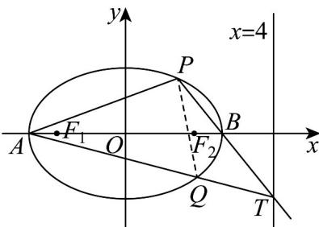
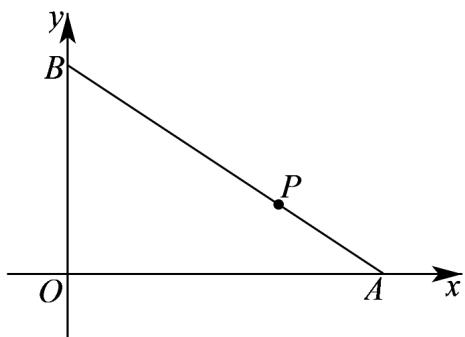

> [!faq]- 《专题10 椭圆标准方程及其性质高频题型精准突破（九大题型）（高效培优期末专项训练）》官方解析
>
> > [!success]- **【答案】** (1) $\frac{x^{2}}{4}+y^{2}=1.$ (2) (i) 证明见解析；(ii) 证明见解析，定点 $(10)$ .
>
> > [!note]- **【分析】**
> > (1)根据椭圆的定义，可以判断出动点 $N$ 的轨迹为椭圆，利用椭圆的定义求 $a, b, c$ ，从而求得轨迹方程.
> >
> > (2) (i) 设 $P(x_{1}, y_{1})$ ， $Q(x_{2}, y_{2})$ ， $T(4, m)$ ，将 $k_{AP}$ 、 $k_{AQ}$ 分别用含 $x_{1}$ ， $y_{1}$ 式子表示，然后利用 $\frac{x_1^2}{4} + y_1^2 = 1$ 消去 $y_{1}$ ，最后即可得出定值；
> >
> > （ii）令直线 $PQ$ 的方程为 $x = ty + n$ ，与椭圆方程联立，应用韦达定理，借助（i）的结论，得到关于 $n$ 的方程，解方程即可求得 $n$ 的值，即定点坐标·
>
> > [!note]- **【解析】**
> > （1）由题意可知， $\left|NE\right|+\left|NF\right|=\left|NM\right|+\left|NE\right|=4>\left|EF\right|=2\sqrt{3}$
> >
> > 由椭圆定义可得，点 N 的轨迹是以 E，F 为焦点的椭圆，
> >
> > 且长轴长 $2a = 4$ ，焦距 $2c = |EF| = 2\sqrt{3}$
> >
> > 所以 $b^{2}=a^{2}-c^{2}=1$
> >
> > 因此曲线 C 方程为 $\frac{x^{2}}{4} + y^{2} = 1$ .
> >
> > (2) 证明：(i) 设 $P(x_{1}, y_{1})$ ， $Q(x_{2}, y_{2})$ ， $T(4, m)$ ，
> >
> > 由题可知 $A(-20)$ ， $B(20)$ ，如下图所示，
> >
> > 则 $k_{AP} = \frac{y_1}{x_1 + 2}$ ， $k_{AQ} = k_{AT} = \frac{m - 0}{4 - (-2)} = \frac{m}{6}$
> >
> > 而 $k_{BP} = k_{BT} = \frac{y_1}{x_1 - 2} = \frac{m}{2}$ ，于是 $m = \frac{2y_1}{x_1 - 2}$
> >
> > 所以 $k_{AP} \cdot k_{AQ} = \frac{y_{1}}{x_{1} + 2} \times \frac{m}{6} = \frac{y_{1}}{x_{1} + 2} \times \frac{y_{1}}{3(x_{1} - 2)} = \frac{y_{1}^{2}}{3(x_{1}^{2} - 4)}$
> >
> > 又 $\frac{x_1^2}{4} + y_1^2 = 1$ ，则 $y_1^2 = \frac{1}{4}\left(4 - x_1^2\right)$ ，
> >
> > 因此 $k_{AP} \cdot k_{AQ} = \frac{\frac{1}{4}\left(4 - x_1^2\right)}{3\left(x_1^2 - 4\right)} = -\frac{1}{12}$ 为定值；
> >
> > (ii) 由题意可知，直线 $PQ$ 不可能与 $x$ 轴平行，
> >
> > 设直线 PQ 的方程为 $x = ty + n$ ， $P(x_{1}, y_{1})$ ， $Q(x_{2}, y_{2})$ ，易知 n > 0
> >
> > 由 $\left\{\begin{aligned}x&=ty+n\\ &\frac{x^{2}}{4}+y^{2}&=1\end{aligned}\right.$ ，得 $\left(t^{2}+4\right)y^{2}+2tny+n^{2}-4=0$
> >
> > $\Delta = (2tn)^{2} - 4(t^{2} + 4)(n^{2} - 4) > 0$ ，得 $t^2 - n^2 - 4 > 0$
> >
> > 所以 $\left\{ \begin{array}{l} y_{1} + y_{2} = -\frac{2tn}{t^{2} + 4} \\ y_{1}y_{2} = \frac{n^{2} - 4}{t^{2} + 4} \end{array} \right.$ (\*)
> >
> > 由(i)可知， $k_{AP} \cdot k_{AQ} = -\frac{1}{12}$
> >
> > $$
> > \frac {y _ {1}}{x _ {1} + 2} \cdot \frac {y _ {2}}{x _ {2} + 2} = \frac {y _ {1} y _ {2}}{(t y _ {1} + n + 2) (t y _ {2} + n + 2)} = \frac {y _ {1} y _ {2}}{t ^ {2} y _ {1} y _ {2} + t (n + 2) (y _ {1} + y _ {2}) + (n + 2) ^ {2}} = - \frac {1}{1 2}
> > $$
> >
> > 将 $(*)$ 代入化简得 $\frac{n^2 - 4}{4n^2 + 16n + 16} = -\frac{1}{12}$ ，解得 $n = 1$ 或 $n = -2$ （舍去），
> >
> > 所以直线 $PQ$ 的方程为 $x = ty + 1$
> >
> > 因此直线 PQ 经过定点 $(10)$ .
> >
> > 
> >
> > 23. 一动圆与圆 $C: (x + 3)^2 + y^2 = 4$ 外切，同时与圆 $D: (x - 3)^2 + y^2 = 64$ 内切，则该动圆圆心的轨迹方程为（）A. $x^2 + y^2 = 25$ B. $\frac{x^2}{25} + \frac{y^2}{16} = 1(x \neq -5)$ C. $\frac{y^2}{25} + \frac{x^2}{34} = 1(y \neq 5)$ D. $\frac{x^2}{25} + \frac{y^2}{34} = 1(x \neq -5)$
> >
> > 【答案】B
> >
> > 【分析】根据给定条件，求得两圆的圆心和半径，判定已知两圆的位置关系为内切，求得切点坐标，利用动圆与已知两圆相外切，内切的条件列出关于 $|PC|, |PD|$ 和动圆半径r的方程组，消去r再利用椭圆的定义写出轨迹方程，最后根据已知两圆的位置关系做出取舍·
> >
> > 【详解】圆 C 的圆心为 $C(-3,0)$ ，半径为 $r_{1}=2$ ，圆 D 的圆心为 $D(3,0)$ ，半径为 $r_{2}=8$ 。
> >
> > 因为 $|CD| = 6 = 8 - 2 = r_2 - r_1$ ，所以两圆相内切于点 $(-5,0)$
> >
> > 设动圆的圆心为 $P(x,y)$ ，半径为 $r(r > 0)$ ，则 $|PC| = r + 2,|PD| = 8 - r$ ， $|PC| + |PD| = 10 > 6 = |CD|$
> >
> > 因此点 P 的轨迹方程是以 C, D 为焦点，长轴长为 $^{10}$ 的椭圆（不含点 $(-5,0)$ ），所以该动圆的圆心的轨迹方程为 $\frac{x^{2}}{25} + \frac{y^{2}}{16} = 1 (x \neq -5)$ .
> >
> > 故选：B
> >
> > 24. 线段 $AB$ 的长度为 3，其两个端点 $A$ 和 $B$ 分别在 $x$ 轴和 $y$ 轴上滑动，则线段 $AB$ 上靠近点 $A$ 的三等分点的轨迹方程为（）A. $x^{2} + y^{2} = \frac{9}{4}$ B. $\frac{x^2}{9} +\frac{y^2}{4} = 1$ C. $\frac{x^2}{4} +y^2 = 1$ D. $\frac{x^2}{4} +\frac{y^2}{9} = 1$
> >
> > 【答案】C
> >
> > 【分析】设点 $A(x_0,0)$ 、 $B(0,y_0)$ ，设线段 $AB$ 上靠近点 $A$ 的三等分点为 $P(x,y)$ ，根据 $\overline{AB} = 3\overline{AP}$ 结合平面向量的坐标运算得出 $\left\{ \begin{array}{l} x_0 = \frac{3}{2} x \\ y_0 = 3y \end{array} \right.$ ，再代入化简即可得出点的轨迹方程·【详解】设点 $A(x_0,0)$ 、 $B(0,y_0)$ ，设线段 $AB$ 上靠近点 $A$ 的三等分点为 $P(x,y)$ ，
> >
> > 
> >
> > 由题意可得 $AB = 3AP$ ，则 $(-x_{0}, y_{0}) = 3(x - x_{0}, y)$ ，
> >
> > 所以， $\left\{\begin{aligned}3(x-x_{0})&=-x_{0}\\ 3y&=y_{0}\end{aligned}\right.$ ，所以， $\left\{\begin{aligned}x_{0}&=\frac{3}{2}x\\ y_{0}&=3y\end{aligned}\right.$
> >
> > 则 $\left|AB\right|^2 = x_0^2 +y_0^2 = \left(\frac{3}{2} x\right)^2 +(3y)^2 = 9$ ，化简得 $\frac{x^2}{4} +y^2 = 1$
> >
> > 故线段 $AB$ 上靠近点 $A$ 的三等分点的轨迹方程为 $\frac{x^2}{4} + y^2 = 1$ .
> >
> > 故选：C.
> >
> > ## 考点05 根据椭圆有界性求参数取值范围
