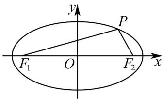

> [!faq]- 《专题10 椭圆标准方程及其性质高频题型精准突破（九大题型）（高效培优期末专项训练）》官方解析
>
> > [!success]- **【答案】** C
>
> > [!note]- **【分析】**
> > 根据椭圆的定义和标准方程、离心率、三角形面积、余弦定理、三角恒等变换等知识对选项进行分析，从而确定正确答案即可·
>
> > [!note]- **【解析】**
> > 如图，作出符合题意的图形，
> >
> > 
> >
> > 对于 A，由题意得椭圆 $C:\frac{x^{2}}{4}+y^{2}=1$
> >
> > 可得 $a = 2, b = 1, c = \sqrt{3}$ ， $2a = 4, \left|F_1F_2\right| = 2c = 2\sqrt{3}$
> >
> > 设 $F_{1}(-\sqrt{3},0), P(x,y)$ ， $-2 \leq x \leq 2$ ，则 $\frac{x^2}{4} + y^2 = 1, y^2 = 1 - \frac{x^2}{4}$
> >
> > 则 $\left|PF_{1}\right|=\sqrt{(x+\sqrt{3})^{2}+y^{2}}=\sqrt{x^{2}+2\sqrt{3}x+3+1-\frac{x^{2}}{4}}=\sqrt{\frac{3x^{2}}{4}+2\sqrt{3}x+4}$
> >
> > 函数 $f(x) = \frac{3x^2}{4} + 2\sqrt{3}x + 4$ 在 $[-2, 2]$ 上单调递增，
> >
> > 所以当 $x = -2$ 时， $\left|PF_1\right|$ 取得最小值，且最小值如下，
> >
> > 为 $\sqrt{\frac{3\times(-2)^{2}}{4}+2\sqrt{3}\times(-2)+4}=\sqrt{7-4\sqrt{3}}=\sqrt{(2-\sqrt{3})^{2}}=2-\sqrt{3}$ ，故 A 错误，
> >
> > 对于 B，由题意得椭圆的离心率 $e=\frac{c}{a}=\frac{\sqrt{3}}{2}$ ，故 B 错误，
> >
> > 对于 $C$ ，由于 $\left|F_1F_2\right| = 2\sqrt{3}$ 为定值，所以当 $P$ 位于椭圆的上下顶点时，
> >
> > 三角形 $PF_{1}F_{2}$ 的面积取得最大值为 $\frac{1}{2} \times 2\sqrt{3} \times 1 = \sqrt{3}$ ，故C正确，
> >
> > 对于 D，设 $\angle F_{1}PF_{2} = \theta$ ，由余弦定理得 $\cos\theta = \frac{\left|PF_{1}\right|^{2} + \left|PF_{2}\right|^{2} - \left|F_{1}F_{2}\right|^{2}}{2\left|PF_{1}\right|\cdot\left|PF_{2}\right|}$
> >
> > $$
> > = \frac {\left(\left| P F _ {1} \right| + \left| P F _ {2} \right|\right) ^ {2} - 1 2 - 2 \left| P F _ {1} \right| \cdot \left| P F _ {2} \right|}{2 \left| P F _ {1} \right| \cdot \left| P F _ {2} \right|} = \frac {1 6 - 1 2 - 2 \left| P F _ {1} \right| \cdot \left| P F _ {2} \right|}{2 \left| P F _ {1} \right| \cdot \left| P F _ {2} \right|}
> > $$
> >
> > $$
> > = \frac {2}{\left| P F _ {1} \right| \cdot \left| P F _ {2} \right|} - 1 \quad \frac {2}{\left(\frac {\left| P F _ {1} \right| + \left| P F _ {2} \right|}{2}\right) ^ {2}} - 1 = \frac {2}{4} - 1 = - \frac {1}{2}
> > $$
> >
> > 当且仅当 $\left|PF_{1}\right|=\left|PF_{2}\right|=2$ 时等号成立，而 $\angle F_{1}PF_{2}\in(0,\pi)$ ，则 $\angle F_{1}PF_{2}=\frac{2\pi}{3}$ ，
> >
> > 可得 $\angle F_{1}PF_{2}$ 的最大值不为 $\frac{5\pi}{6}$ ，故 $^{\mathrm{D}}$ 错误
> >
> > 故选 **C**
