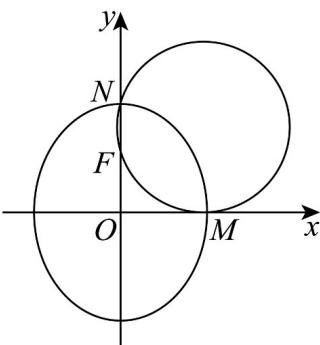

> [!faq]- 《专题10 椭圆标准方程及其性质高频题型精准突破（九大题型）（高效培优期末专项训练）》官方解析
>
> > [!success]- **【答案】** B
>
> > [!note]- **【分析】**
> > 利用过 $M, N, F$ 三点的圆恰与 $x$ 轴相切，求出圆的标准方程，再利用点 $N$ 在圆上，坐标适合方程即可求解。
>
> > [!note]- **【解析】**
> > 由已知可得： $M(b,0)$ ， $N(0,a)$ ， $F(0,c)$ ，
> >
> > 
> >
> > 线段 $NF$ 的垂直平分线方程为 $y = \frac{a + c}{2}$ ，过 $M, N, F$ 三点的圆恰与 $x$ 轴相切，所以圆心坐标为 $\left(b, \frac{a + c}{2}\right)$ ，圆的半径为 $\frac{a + c}{2}$ ，所以经过 $M, N, F$ 三点的圆的方程为 $(x - b)^2 + \left(y - \frac{a + c}{2}\right)^2 = \left(\frac{a + c}{2}\right)^2$ ， $N(0, a)$ 在圆上，所以 $(0 - b)^2 + \left(a - \frac{a + c}{2}\right)^2 = \left(\frac{a + c}{2}\right)^2$ 整理得： $b^2 = ac$ ，所以 $a^2 - c^2 = ac$ ，所以 $c^2 + ac - a^2 = 0$ ，化为： $e^2 + e - 1 = 0$ ，由 $0 < e < 1$ ，解得 $e = \frac{\sqrt{5} - 1}{2}$ 。
> >
> > 故选 **B**.
