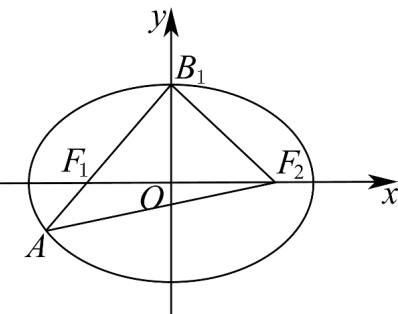

> [!faq]- 《专题10 椭圆标准方程及其性质高频题型精准突破（九大题型）（高效培优期末专项训练）》官方解析
>
> > [!success]- **【答案】** ACD
>
> > [!note]- **【分析】**
> > 根据椭圆的定义、 $a,b,c,e$ 的关系及余弦定理对选项逐一分析即可·
>
> > [!note]- **【解析】**
> > 对于 $\mathbb{C}$ ： $\left|B_1F_1\right| = \left|B_1F_2\right| = a$ ， $\left|AF_1\right| = \frac{1}{2} a$ ，则 $\left|AF_2\right| = \frac{3}{2} a$ 所以 $\left|AB_1\right| = \left|AF_2\right| = \frac{3}{2} a$ 所以 $\triangle AB_{1}F_{2}$ 为等腰三角形，故 $\mathbb{C}$ 正确；
> > 对于A： $\angle B_1F_1F_2 + \angle AF_1F_2 = \pi$ 所以 $\frac{\frac{a^2}{4} + 4c^2 - \frac{9a^2}{4}}{2\times\frac{a}{2}\times 2c} = -\frac{c}{a}$ ，解得 $a^2 = 3c^2$ 所以 $\mathrm{e}^2 = \frac{1}{3}$ ，所以 $\mathrm{e} = \frac{\sqrt{3}}{3}$ ，故A正确；
> > 对于B： $k_{AB_1} = \tan \angle B_1F_1F_2 = \frac{b}{c} = \sqrt{\frac{a^2 - c^2}{c^2}} = \sqrt{2}$ ，故B错误；
> > 对于D： $a^2 = 3c^2 = 3a^2 -3b^2$ ，所以 $b^{2} = \frac{2}{3} a^{2}$ 所以 $b = \frac{\sqrt{6}}{3} a$ ，所以 $\left|B_1B_2\right| = \frac{2\sqrt{6}}{3} a$ ，故D正确·
> >
> > 
> >
> > 故选：ACD·
> >
> > ## 考点07 求椭圆离心率取值范围问题
