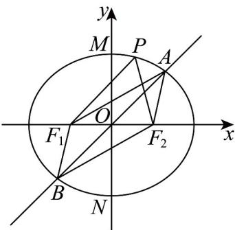

> [!faq]- 《专题10 椭圆标准方程及其性质高频题型精准突破（九大题型）（高效培优期末专项训练）》官方解析
>
> > [!success]- **【答案】** AC
>
> > [!note]- **【分析】**
> > 由焦半径范围公式 $a - c \leq |PF_2| \leq a + c$ 即可求解判断A；求出焦三角中 $\angle F_{1}PF_{2}$ 最大值即可判断B，由对称性得 $\left|BF_{1}\right| = \left|AF_{2}\right|$ ，再结合椭圆定义即可求解判断C，对于D，法一：由椭圆定义结合余弦定理求出 $\left|PF_{1}\right|\left|PF_{2}\right|$ 即可由面积公式求解 $\frac{1}{2}\left|PF_{1}\right|\left|PF_{2}\right|\sin \frac{\pi}{3}$ ；法二：直接利用椭圆的焦点三角形面积公式 $S_{\triangle F_1PF_2} = b^2\tan \frac{\angle F_1PF_2}{2}$ 求解.
>
> > [!note]- **【解析】**
> > 对于 A，当点 P 为椭圆 C 的左顶点时， $\left|PF_{2}\right|$ 取得最大值 $a + c = 3$ ；
> >
> > 当点 $P$ 为椭圆 $C$ 的右顶点时， $\left|PF_2\right|$ 取得最小值 $a - c = 1$ ，∴ $1\leq \left|PF_{2}\right|\leq 3$ ，故A正确；
> >
> > 对于 $^{B}$ ，记M，N分别为椭圆C的上、下顶点，则点P与点M或N重合时 $\angle F_{1}PF_{2}$ 最大，
> >
> > 易知 $|MF_{1}| = |MF_{2}| = |F_{1}F_{2}| = 2$ ， $^{\triangle} F_{1}MF_{2}$ 为正三角形，
> >
> > $\therefore \left(\angle F_{1}PF_{2}\right)_{\max}=60^{\circ}$ ，所以椭圆 $C$ 上不存在点 $P$ 使得 $\angle F_{1}PF_{2}=90^{\circ}$ ，故 $B$ 错误；
> >
> > 对于 C，由椭圆的对称性知，四边形 $AF_{1}BF_{2}$ 为平行四边形，∴ $|BF_{1}| = |AF_{2}|$ ，
> >
> > 从而由椭圆的定义得 $\left|AF_{1}\right|+\left|BF_{1}\right|=\left|AF_{1}\right|+\left|AF_{2}\right|=2a=4$ ，故 C 正确；
> >
> > 对于 D，方法一，∵ $\left|PF_{1}\right| + \left|PF_{2}\right| = 4$ ①
> >
> > 又在 $\triangle PF_{1}F_{2}$ 中， $\left|PF_{1}\right|^{2} + \left|PF_{2}\right|^{2} - 2\left|PF_{1}\right|\left|PF_{2}\right|\cos \frac{\pi}{3} = \left|F_{1}F_{2}\right|^{2} = 4$
> >
> > 即 $\triangle PF_{1}F_{2}$ 中， $\left|PF_{1}\right|^{2}+\left|PF_{2}\right|^{2}-\left|PF_{1}\right|\left|PF_{2}\right|=4$ ②，
> >
> > 联立①②得 $\left|PF_{1}\right|\left|PF_{2}\right|=4$
> >
> > $\therefore \triangle F_{1}PF_{2}$ 的面积为 $\frac{1}{2}|PF_1||PF_2|\sin \frac{\pi}{3} = \frac{1}{2}\times 4\times \frac{\sqrt{3}}{2} = \sqrt{3}$ .
> >
> > 方法二： $\therefore S_{\triangle F_1PF_2} = b^2 \tan \frac{\angle F_1PF_2}{2} = 3 \times \tan 30^\circ = \sqrt{3}$ ，所以 D 错误。
> >
> > 故选：AC
> >
> > 
