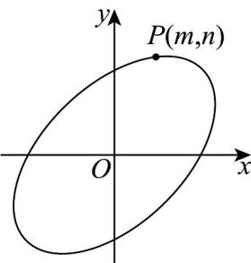

> [!faq]- 《专题10 椭圆标准方程及其性质高频题型精准突破（九大题型）（高效培优期末专项训练）》官方解析
>
> > [!success]- **【答案】**  A. 曲线 $C$ 关于 $y = x$ 对称 B. $m + n$ 的最大值为 $2\sqrt{6}$ C. 该椭圆的离心率为 $\frac{\sqrt{2}}{2}$ D. $n$ 的最大值为 $2\sqrt{2}$
>
> > [!note]- **【分析】**
> > 根据曲线对称性的定义，可判断 $^{A}$ 的真假，并求出椭圆的长轴长和短轴长，根据离心率的概念，可求椭圆的离心率，判断 $^{C}$ 的真假；利用基本（均值）不等式可以判断 $^{B}$ 的真假；把方程看成关于m的不等式，利用 $\Delta\quad0$ 可求n的取值范围，判断 $^{D}$ 的真假。
>
> > [!note]- **【解析】**
> > 在曲线 C 上任取一点 $P(m,n), m^{2}+n^{2}-mn=6$ ，点 P 关于直线 y=x 的对称点为 $Q(n,m)$ ，则 $m^{2}+n^{2}-mn=6$ ，即点 Q 也在曲线 C 上，故曲线 C 关于直线 y=x 对称，A 正确；
> > 由题意知 $m^{2}+n^{2}-mn=6$ ， $m^{2}+n^{2}\frac{(m+n)^{2}}{2}$ ， $mn\leq\frac{(m+n)^{2}}{4}$ ， $m^{2}+n^{2}-mn=6\frac{(m+n)^{2}}{4}$ ， $m+n\leq2\sqrt{6}$ ，B 正确：
> > 联立方程 $\left\{\begin{aligned}x^{2}+y^{2}-xy=6\\ y=x\end{aligned}\right.$ ，解得顶点坐标为 $(\sqrt{6},\sqrt{6})$ 和 $(- \sqrt{6}, - \sqrt{6})$ ，
> > 所以椭圆长轴长为 $2a = 2\sqrt{12} = 4\sqrt{3} \Rightarrow a = 2\sqrt{3}$ ；同理可得另外两个顶点坐标为 $(\sqrt{2}, -\sqrt{2})$ 和 $(- \sqrt{2}, \sqrt{2})$
> >
> > 所以椭圆的短轴长为 $2b = 2\sqrt{4} = 4 \Rightarrow b = 2$ ，所以 $c = \sqrt{a^2 - b^2} = \sqrt{12 - 4} = 2\sqrt{2}$
> >
> > 所以该椭圆的离心率为： $e=\frac{c}{a}=\frac{2\sqrt{2}}{2\sqrt{3}}=\frac{\sqrt{6}}{3}$ ，C 错误；
> >
> > $m^2 + n^2 - mn = 6$ 看作关于 $m$ 的一元二次方程， $\Delta = n^2 - 4(n^2 - 6) \quad 0$
> >
> > 解得 $-2\sqrt{2} \leq n \leq 2\sqrt{2}$ ，D 正确，
> >
> > 故选 **ABD**.
