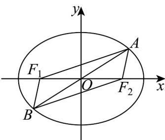

> [!faq]- 《专题10 椭圆标准方程及其性质高频题型精准突破（九大题型）（高效培优期末专项训练）》官方解析
>
> > [!success]- **【答案】** A
>
> > [!note]- **【分析】**
> > 根据方程可得 $a, b, c$ ，结合椭圆定义可得 $\left|AF_1\right| = 6, \left|AF_2\right| = 2$ ，再利用余弦定理以及几何性质分析求解.
>
> > [!note]- **【解析】**
> > 由椭圆方程可知： $a = 4,b = 3,c = \sqrt{a^2 - b^2} = \sqrt{7}$ ，即 $\left|F_1F_2\right| = 2\sqrt{7}$
> >
> > 
> >
> > 因为 $\left|AF_1\right| + \left|AF_2\right| = 2a = 8$ ，且 $\left|AF_1\right| = 3\left|AF_2\right|$ ，可得 $\left|AF_1\right| = 6,\left|AF_2\right| = 2$
> >
> > 在 $\triangle AF_1F_2$ 中， $\cos \angle F_1AF_2 = \frac{\left|AF_1\right|^2 + \left|AF_2\right|^2 - \left|F_1F_2\right|^2}{2\left|AF_1\right|\cdot\left|AF_2\right|} = \frac{36 + 4 - 28}{2\times 6\times 2} = \frac{1}{2}$
> >
> > 由椭圆性质可知： $\left|OF_{1}\right|=\left|OF_{2}\right|,\left|OA\right|=\left|OB\right|$ ，即四边形 $AF_{1}BF_{2}$ 为平行四边形，
> >
> > 所以 $\cos\angle AF_{1}B=\cos\left(\pi-\angle F_{1}AF_{2}\right)=-\cos\angle F_{1}AF_{2}=-\frac{1}{2}$
> >
> > 故选 **A**.
