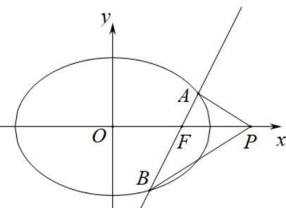

> [!faq]- 《专题10 椭圆标准方程及其性质高频题型精准突破（九大题型）（高效培优期末专项训练）》官方解析
>
> > [!success]- **【答案】** (1) $\frac{x^{2}}{2}+y^{2}=1$ (2) $\frac{3\sqrt{6}}{2}$ (3)答案见解析
>
> > [!note]- **【分析】**
> > （1）利用椭圆的对称性分析得椭圆 C 所过三个点，从而得到关于 a, b, c 的方程组，解之即可得解；
> > (2) 利用三角换元法，结合点线距离公式与三角函数恒等变化即可得解；
> >
> > （3）联立直线 $l$ 与椭圆方程，利用韦达定理，结合题设条件 $\angle APO = \angle BPO$ 得到关于 $a$ 的方程组，解之即可得解·
>
> > [!note]- **【解析】**
> > （1）由椭圆的对称性可知椭圆 $C$ 必过 $P_{3}\left(-1, \frac{\sqrt{2}}{2}\right)$ ， $P_{4}\left(1, \frac{\sqrt{2}}{2}\right)$ 两点，
> >
> > 因为 $P_{1}(1,1)$ 与 $P_{4}\left(1,\frac{\sqrt{2}}{2}\right)$ 不可能同时在同一个椭圆上，
> >
> > 所以椭圆 $C$ 过 $P_{2}(0,1)$ ， $P_{3}\left(-1,\frac{\sqrt{2}}{2}\right)$ ， $P_{4}\left(1,\frac{\sqrt{2}}{2}\right)$ 三点，
> >
> > 于是 $\left\{ \begin{array}{l} b = 1 \\ \frac{1}{a^2} + \frac{2}{4b^2} = 1 \end{array} \right.$ ，解得 $a = \sqrt{2}, b = 1$
> >
> > 故椭圆的方程为 $\frac{x^2}{2} + y^2 = 1$ .
> >
> > (2) 因为点 Q 在椭圆 $\frac{x^{2}}{2} + y^{2} = 1$ 上，不妨设 $Q\left(\sqrt{2}\cos\theta, \sin\theta\right), \theta \in[0,2\pi]$
> >
> > 则点 Q 到直线 $x - y + 2\sqrt{3} = 0$ 距离为
> >
> > $d = \frac{\left|\sqrt{2}\cos\theta - \sin\theta + 2\sqrt{3}\right|}{\sqrt{2}} = \frac{\left|\sqrt{3}\cos(\theta + \varphi) + 2\sqrt{3}\right|}{\sqrt{2}}$ ，其中 $\cos\varphi = \frac{\sqrt{2}}{\sqrt{3}}, \sin\varphi = \frac{1}{\sqrt{3}}$ 所以当 $\cos(\theta+\varphi)=1$ ，即 $\cos\theta=\frac{\sqrt{2}}{\sqrt{3}}$ , $\sin\theta=-\frac{1}{\sqrt{3}}$ 时，d 取得最大值，为 $\frac{3\sqrt{3}}{\sqrt{2}}=\frac{3\sqrt{6}}{2}$ ，即椭圆 C 上点 Q 到直线 $x-y+2\sqrt{3}=0$ 距离的最大值为 $\frac{3\sqrt{6}}{2}$ .
> >
> > (3) 假设存在 $P(m,0)$ ，由于 $F(1,0)$
> >
> > 当直线 $l$ 斜率为0时， $l$ 方程为 $y = 0$ ，点 $P$ 在椭圆外的 $x$ 轴上任意点都符合题意，
> >
> > 当直线 $l$ 斜率不为 $0$ 时，可设直线 $l$ 方程为 $x = ty + 1$ ， $A(x_1, y_1)$ ， $B(x_2, y_2)$
> >
> > 
> >
> > 联立方程组 $\left\{\begin{aligned}x&=ty+1\\ \frac{x^{2}}{2}&+y^{2}=1\end{aligned}\right.$ ，得 $\left(t^{2}+2\right)y^{2}+2ty-1=0$
> >
> > 易知 $\Delta > 0$ ，则 $y_{1} + y_{2} = \frac{-2t}{t^{2} + 2}, y_{1}y_{2} = \frac{-1}{t^{2} + 2}$ ，故 $2ty_{1}y_{2} = y_{1} + y_{2}$ ，
> >
> > 若 $\angle APO = \angle BPO$ ，则 $k_{PA} + k_{PB} = \frac{y_1}{x_1 - m} +\frac{y_2}{x_2 - m} = 0$
> >
> > 即 $\frac{y_1(ty_2 + 1 - m) + y_2(ty_1 + 1 - m)}{(x_1 - m)(x_2 - m)} = \frac{2ty_1y_2 + (1 - m)(y_1 + y_2)}{(x_1 - m)(x_2 - m)} = 0$
> >
> > 则 $2ty_{1}y_{2} + (1 - m)(y_{1} + y_{2}) = 0$ ，即 $y_{1} + y_{2} + (1 - m)(y_{1} + y_{2}) = 0$
> >
> > 所以 $\left(1 + 1 - m\right)\left(y_1 + y_2\right) = 0 \Rightarrow 2 - m = 0 \Rightarrow m = 2$ ，因此 $m = 2$ ，
> >
> > 此时 $P(2,0)$ ，显然直线 l 斜率为 0 时也符合题意，
> >
> > 即存在点 $P(2,0)$ 使得 $\angle APO = \angle BPO$
> >
> > ## 考点09 直线与椭圆联立问题解周长面积问题
