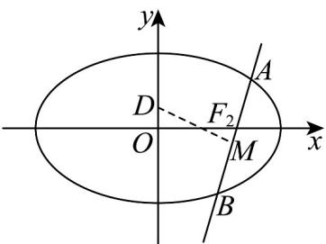

> [!faq]- 《专题10 椭圆标准方程及其性质高频题型精准突破（九大题型）（高效培优期末专项训练）》官方解析
>
> > [!success]- **【答案】** (1) $\frac{x^{2}}{4}+y^{2}=1$ (2) 存在， $D\left(0, \pm \frac{9}{7}\right)$
>
> > [!note]- **【分析】**
> > （1）由题意求出 $a$ ，设点 $A(x_1, y_1)$ ， $B(x_2, y_2)$ ，利用点差法，结合 $k_{AB} \cdot k_{OM} = -\frac{1}{4}$ ，推出 $b$ ，得到椭圆 $C$ 方程；
> >
> > (2) 设直线 $l: y = k(x - \sqrt{3})$ ，联立直线与椭圆方程，利用韦达定理，求解 $M$ 点坐标，推出 $D$ 点坐标，利用弦长公式转化求解即可。
>
> > [!note]- **【解析】**
> > （1）由题意可知， $2a = 4$ ， $a = 2$
> >
> > 设点 $A(x_{1},y_{1})$ ， $B(x_{2},y_{2})$ ， $A$ ， $B$ 在椭圆上，所以 $\frac{x_1^2}{a^2} +\frac{y_1^2}{b^2} = 1$ ， $\frac{x_2^2}{a^2} +\frac{y_2^2}{b^2} = 1$
> >
> > 两式相减得 $\frac{(x_1 + x_2)(x_1 - x_2)}{a^2} +\frac{(y_1 + y_2)(y_1 - y_2)}{b^2} = 0$ ，所以 $\frac{(y_1 + y_2)(y_1 - y_2)}{(x_1 + x_2)(x_1 - x_2)} = -\frac{a^2}{b^2}$
> >
> > 因为 $k_{AB} \cdot k_{OM} = -\frac{1}{4}$ ，所以 $\frac{y_2 - y_1}{x_2 - x_1} \cdot \frac{y_2 + y_1}{x_2 + x_1} = -\frac{1}{4}$ ，所以 $-\frac{b^2}{a^2} = -\frac{1}{4}$ ，所以 $b^2 = 1$ ，
> >
> > 所以椭圆 $C$ 方程为 $\frac{x^2}{4} + y^2 = 1$
> >
> > 
> >
> > (2) 椭圆右焦点 $F_{2}\left(\sqrt{3},0\right)$ ，设直线 $l:y=k\left(x-\sqrt{3}\right)$
> >
> > 代入椭圆方程得 $\left(1+4k^{2}\right)x^{2}-8\sqrt{3}k^{2}x+12k^{2}-4=0$ ，
> >
> > 所以 $x_{1} + x_{2} = \frac{8\sqrt{3}k^{2}}{1 + 4k^{2}}$ ， $x_{1}x_{2} = \frac{12k^{2} - 4}{1 + 4k^{2}}$ ，
> >
> > 所以 $x_{M} = \frac{x_{1} + x_{2}}{2} = \frac{4\sqrt{3}k^{2}}{1 + 4k^{2}},y_{M} = k\left(\frac{4\sqrt{3}k^{2}}{1 + 4k^{2}} -\sqrt{3}\right) = -\frac{\sqrt{3}k}{1 + 4k^{2}}$ ，即 $M\left(\frac{4\sqrt{3}k^2}{1 + 4k^2}, - \frac{\sqrt{3}k}{1 + 4k^2}\right)$
> >
> > 假设存在点 $D$ ，则 $MD$ 的直线方程为 $y + \frac{\sqrt{3}k}{1 + 4k^2} = -\frac{1}{k}\left(x - \frac{4\sqrt{3}k^2}{1 + 4k^2}\right)$
> >
> > 所以 $D\left(0, \frac{3\sqrt{3}k}{1 + 4k^2}\right)$
> >
> > $$
> > \left| A B \right| = \sqrt {1 + k ^ {2}} \left| x _ {1} - x _ {2} \right| = \sqrt {1 + k ^ {2}} \sqrt {\left(x _ {1} + x _ {2}\right) ^ {2} - 4 x _ {1} x _ {2}} = \frac {4 (1 + k ^ {2})}{1 + 4 k ^ {2}},
> > $$
> >
> > $$
> > \left| M D \right| = \sqrt {1 + \frac {1}{k ^ {2}}} \left| \frac {4 \sqrt {3} k ^ {2}}{1 + 4 k ^ {2}} - 0 \right| = \frac {4 \sqrt {3} | k | \sqrt {k ^ {2} + 1}}{1 + 4 k ^ {2}},
> > $$
> >
> > 若 $\triangle ABD$ 为等边三角形，则 $\left|MD\right| = \frac{\sqrt{3}}{2}\left|AB\right|$
> >
> > 即 $\frac{\sqrt{3}}{2} \times \frac{4(1 + k^2)}{1 + 4k^2} = \frac{4\sqrt{3}|k|\sqrt{k^2 + 1}}{1 + 4k^2}$ ，解得 $k^2 = \frac{1}{3}$ ，此时 $\frac{3\sqrt{3}k}{1 + 4k^2} = \pm \frac{9}{7}$ ，
> >
> > 所以存在点 $D\left(0, \pm \frac{9}{7}\right)$ ，使得 $\triangle ABD$ 为等边三角形
