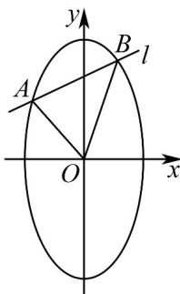

> [!faq]- 《专题10 椭圆标准方程及其性质高频题型精准突破（九大题型）（高效培优期末专项训练）》官方解析
>
> > [!success]- **【答案】** (1) $\frac{y^{2}}{4}+x^{2}=1$ ; (2)1.
>
> > [!note]- **【分析】**
> > （1）利用椭圆离心率及给定面积建立a,b的方程求解.
> >
> > (2) 按直线 l 的斜率是否存在设出方程，与椭圆方程联立，利用弦长公式及点到直线距离公式列出三角形面积表达式，再利用基本不等式求出最大值.
>
> > [!note]- **【解析】**
> > （1）由椭圆 $C: \frac{y^2}{a^2} + \frac{x^2}{b^2} = 1 (a > b > 0)$ 的离心率为 $\frac{\sqrt{3}}{2}$ ，得 $\frac{\sqrt{a^2 - b^2}}{a} = \frac{\sqrt{3}}{2}$ ，解得 $a = 2b$ ，
> >
> > 由椭圆 C 的四个顶点为顶点的四边形的面积为 $^{4}$ ，得 $\frac{1}{2} \cdot 2a \cdot 2b = 4$ ，即 ab = 2，解得 a = 2, b = 1，
> >
> > 所以椭圆 C 的标准方程为 $\frac{y^{2}}{4} + x^{2} = 1$ .
> >
> > (2) 当直线 l 斜率存在时，设其方程为 $y = kx + t, t \neq 0$ ， $A(x_{1}, y_{1}), B(x_{2}, y_{2})$
> >
> > 由 $\left\{\begin{aligned}y&=kx+t\\ y^{2}&+4x^{2}=4\end{aligned}\right.$ 消去 $y$ 得 $(k^{2}+4)x^{2}+2ktx+t^{2}-4=0$
> >
> > $$
> > \Delta = 4 k ^ {2} t ^ {2} - 4 \left(k ^ {2} + 4\right) \left(t ^ {2} - 4\right) = 1 6 \left(k ^ {2} + 4 - t ^ {2}\right) > 0, \quad \left\{ \begin{array}{l} x _ {1} + x _ {2} = - \frac {2 k t}{k ^ {2} + 4} \\ x _ {1} x _ {2} = \frac {t ^ {2} - 4}{k ^ {2} + 4} \end{array} , \right.
> > $$
> >
> > $$
> > \left| A B \right| = \sqrt {1 + k ^ {2}} \cdot \sqrt {\left(x _ {1} + x _ {2}\right) ^ {2} - 4 x _ {1} x _ {2}} = \sqrt {1 + k ^ {2}} \cdot \sqrt {\left(- \frac {2 k t}{k ^ {2} + 4}\right) ^ {2} - 4 \cdot \frac {t ^ {2} - 4}{k ^ {2} + 4}}
> > $$
> >
> > $= \sqrt{1 + k^2}\cdot \frac{4\sqrt{k^2 + 4 - t^2}}{k^2 + 4}$ ，原点 $O$ 到直线 $l$ 的距离 $d = \frac{|t|}{\sqrt{1 + k^2}}$
> >
> > 因此 $\mathrm{V}_{AOB}$ 的面积 $S_{\triangle AOB} = \frac{1}{2}|AB|\cdot d = \frac{2\sqrt{k^2 + 4 - t^2}\cdot|t|}{k^2 + 4}\leq \frac{(\sqrt{k^2 + 4 - t^2})^2 + t^2}{k^2 + 4} = 1$
> >
> > 当且仅当 $k^{2}+4=2t^{2}$ 时取等号，此时 $\Delta=16t^{2}>0$ ，符合题意；
> >
> > 当直线 l 斜率不存在时，设其方程为 $x = m, 0 < |m| < 1$
> >
> > 由 $\left\{ \begin{array}{l} x = m \\ y^2 + 4x^2 = 4 \end{array} \right.$ ，得 $|y| = 2\sqrt{1 - m^2}$ ， $|AB| = 4\sqrt{1 - m^2}$ ，
> >
> > <!-- source-part:2 pages:51-53 -->
> >
> > 因此 $\mathrm{V}_{AOB}$ 的面积 $S_{\triangle AOB} = \frac{1}{2}|AB|\cdot |m| = 2\sqrt{1 - m^2}\cdot |m|\leq (\sqrt{1 - m^2})^2 +m^2 = 1$
> >
> > 当且仅当 $\sqrt{1 - m^2} = |m|$ ，即 $|m| = \frac{\sqrt{2}}{2}$ 时取等号，
> >
> > 所以 VAOB 面积的最大值为 1.
> >
> > 
