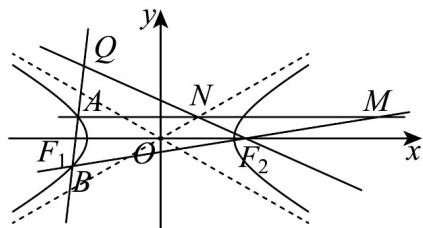

> [!faq]- 《专题11 双曲线标准方程及其性质高频题型精准突破（十大题型）（高效培优期末专项训练）》官方解析
>
> > [!success]- **【答案】** (1) $\frac{x^{2}}{3}-y^{2}=1$ (2) $\sqrt{2} x - y + 2\sqrt{2} = 0$ (3)证明见解析
>
> > [!note]- **【分析】**
> > （1）根据双曲线的定义，以及题中条件，即可得出双曲线的方程；
> >
> > (2) 设 $A(x_1, y_1)$ ， $B(x_2, y_2)$ ，先由题中条件，得到直线斜率为正，设直线 $l$ 的方程为： $x = ty - 2(t > 0)$ ，联立直线与双曲线方程，利用韦达定理，以及 $\overline{BF}_1 = 5\overline{F}_1A$ ，列出方程组求解即可；
> >
> > (3) 同 (2) 设 $A(x_1, y_1)$ ， $B(x_2, y_2)$ ，直线 $l$ 的方程为： $x = ty - 2$ ，得 $y_1 + y_2 = \frac{4t}{t^2 - 3}$ ， $y_1y_2 = \frac{1}{t^2 - 3}$ ；直线 $m$ 的方程为 $y = y_1$ ；写出直线 $BF_2$ 的方程，进而求出点 $M$ 横坐标，得出点 $N$ 坐标，求出直线 $NF_2$ 的方程与 $l$ 联立，即可求出 $Q$ 点横坐标，从而证明结论成立。
>
> > [!note]- **【解析】**
> > （1）因为 $\left\|PF_{1}\right|-\left|PF_{2}\right\|=2\sqrt{3}<4=\left|F_{1}F_{2}\right|$
> >
> > 所以点 $P$ 的轨迹是以 $F_{1}, F_{2}$ 为焦点的双曲线，且焦距为 $2c = 2$ ，实轴长为 $2a = 2\sqrt{3}$
> >
> > 所以 $c = 2$ ， $a = \sqrt{3}$ ，则 $b^{2} = c^{2} - a^{2} = 1$
> >
> > 因此双曲线 C 的方程为 $\frac{x^{2}}{3}-y^{2}=1$ ;
> >
> > (2) 设 $A(x_{1}, y_{1})$ ， $B(x_{2}, y_{2})$ ，则 $BF_{1} = (-2 - x_{2}, -y_{2})$ ， $F_{1}A = (x_{1} - 2, y_{1})$
> >
> > 因为点 $A$ 在 $x$ 轴上方，且 $\overline{BF_1} = 5\overline{F_1} A$ ，所以易知直线 $l$ 的斜率存在，且斜率大于零，
> >
> > 因此可设直线 l 的方程为： $x = ty - 2(t > 0)$
> >
> > 由 $\left\{ \begin{array}{l} x = ty - 2 \\ \frac{x^2}{3} - y^2 = 1 \end{array} \right.$ 得 $(ty - 2)^2 - 3y^2 - 3 = 0$ ，即 $(t^2 - 3)y^2 - 4ty + 1 = 0$
> >
> > 所以 $y_{1} + y_{2} = \frac{4t}{t^{2} - 3}$ ①， $y_{1}y_{2} = \frac{1}{t^{2} - 3}$ ②， $\Delta = 16t^2 - 4(t^2 - 3) = 12t^2 + 12 > 0$
> >
> > 又 $BF_{1}=5F_{1}A$ ，所以 $-y_{2}=5y_{1}$ ③
> >
> > 由①③得 $\left\{\begin{aligned}y_{1}&=\frac{-t}{t^{2}-3}\\ y_{2}&=\frac{5t}{t^{2}-3}\end{aligned}\right.$ 代入②可得 $y_{1}y_{2}=\frac{-5t^{2}}{\left(t^{2}-3\right)^{2}}=\frac{1}{t^{2}-3}$ ，即 $t^{2}=\frac{1}{2}$ ，解得 $t=\frac{\sqrt{2}}{2}$ （负值舍去），
> >
> > 因此直线 $l$ 的方程为： $x = \frac{\sqrt{2}}{2} y - 2$ ，即 $\sqrt{2} x - y + 2\sqrt{2} = 0$
> >
> > (3) 同 (2) 设 $A(x_{1}, y_{1})$ , $B(x_{2}, y_{2})$ ，直线 l 的方程为：x = ty - 2，
> >
> > 则 $y_{1} + y_{2} = \frac{4t}{t^{2} - 3}$ ， $y_{1}y_{2} = \frac{1}{t^{2} - 3}$ ；
> >
> > 
> >
> > 因为直线 m 过点 A 与 x 轴平行，所以直线 m 的方程为 $y = y_{1}$ ；
> >
> > 又 $k_{BF_2} = \frac{y_2}{x_2 - 2}$ ，则直线 $BF_{2}$ 的方程为 $y = \frac{y_2}{x_2 - 2}(x - 2)$
> >
> > 由 $\left\{\begin{aligned}y&=\frac{y_{2}}{x_{2}-2}(x-2)\\ y&=y_{1}\end{aligned}\right.$ 得 $x=\frac{y_{1}(x_{2}-2)}{y_{2}}+2=\frac{y_{1}(ty_{2}-4)}{y_{2}}+2=\frac{ty_{1}y_{2}-4y_{1}}{y_{2}}+2$
> >
> > 则 $x_{M} = \frac{ty_{1}y_{2} - 4y_{1}}{y_{2}} + 2$ ，所以 $x_{N} = \frac{x_1 + x_M}{2} = \frac{ty_1 - 2 + \frac{ty_1y_2 - 4y_1}{y_2} + 2}{2} = \frac{ty_1y_2 - 2y_1}{y_2}$
> >
> > 即 $N\left(\frac{ty_{1}y_{2}-2y_{1}}{y_{2}},y_{1}\right)$ ,
> >
> > 所以 $k_{NF_{2}}=\frac{y_{1}}{\frac{ty_{1}y_{2}-2y_{1}}{y_{2}}-2}=\frac{y_{1}y_{2}}{ty_{1}y_{2}-2(y_{1}+y_{2})}=\frac{\frac{1}{t^{2}-3}}{\frac{t}{t^{2}-3}-\frac{8t}{t^{2}-3}}=-\frac{1}{7t}$
> >
> > 因此直线 $NF_{2}$ 的方程为： $y = -\frac{1}{7t}(x - 2)$
> >
> > 因为点 $Q$ 是直线 $l$ 与直线 $NF_{2}$ 的交点，
> >
> > 由 $\left\{\begin{aligned}y&=-\frac{1}{7t}(x-2)\\ x&=ty-2\end{aligned}\right.$ 得 $\frac{x+2}{t}=-\frac{1}{7t}(x-2)$ ，解得 $x=-\frac{3}{2}$ ，
> >
> > 所以点 $Q$ 的横坐标是 $-\frac{3}{2}$ ，因此点 $Q$ 恒在定直线 $x = -\frac{3}{2}$ 上.
