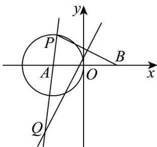

> [!faq]- 《专题11 双曲线标准方程及其性质高频题型精准突破（十大题型）（高效培优期末专项训练）》官方解析
>
> > [!success]- **【答案】** A. $x^2 - \frac{y^2}{8} = 1$ B. $x^2 - \frac{y^2}{6} = 1$ C. $y^2 - \frac{x^2}{8} = 1$ D. $y^2 - \frac{x^2}{6} = 1$
>
> > [!note]- **【分析】**
> > 结合双曲线的定义求得正确答案·
>
> > [!note]- **【解析】**
> > 
> >
> > 圆 A 的圆心为 $A(-3,0)$ ，半径为 r=2，由中垂线的性质可得 $\left|QP\right|=\left|QB\right|$
> >
> > 所以 $\left|\left|QB\right|-\left|QA\right|\right|=\left|\left|QP\right|-\left|QA\right|\right|=r=2<\left|AB\right|$
> >
> > 所以 $Q$ 点的轨迹方程是双曲线，且 $c = 3, 2a = 2, a = 1, b^2 = c^2 - a^2 = 8$ 所以 $Q$ 点的轨迹方程为 $x^2 - \frac{y^2}{8} = 1$ .
> >
> > 故选 **A**.
