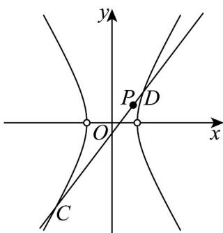

> [!faq]- 《专题11 双曲线标准方程及其性质高频题型精准突破（十大题型）（高效培优期末专项训练）》官方解析
>
> > [!success]- **【答案】** (1) $x^{2}-\frac{y^{2}}{3}=1(x\neq\pm1)$ ，点M的轨迹是除去 $(-1,0)$ ， $(1,0)$ 两点的双曲线 (2)不是线段 $CD$ 的中点，理由见解析
>
> > [!note]- **【分析】**
> > （ $^{1}$ ）根据斜率公式化简得出轨迹方程；
> >
> > (2) 法一：联立直线 $CD$ 与双曲线的方程，结合韦达定理和中点坐标公式，列出方程，作出判断；
> >
> > 法二：利用点差法得出直线方程，再与双曲线方程联立，判别式检验·
>
> > [!note]- **【解析】**
> > （1）解：设点M的坐标为 $(x,y)$ ，
> >
> > 因为 A, B 两点的坐标分别为 $(-1,0)$ , $(1,0)$ ,
> >
> > 所以直线 AM 的斜率为 $k_{AM} = \frac{y}{x + 1} (x \neq -1)$
> >
> > 所以直线 BM 的斜率为 $k_{BM} = \frac{y}{x - 1} (x \neq 1)$
> >
> > 由已知得 $k_{AM} \cdot k_{BM} = \frac{y}{x + 1} \times \frac{y}{x - 1} = 3 (x \neq \pm 1)$ ，
> >
> > 化简得点 $M$ 的轨迹方程为 $x^{2} - \frac{y^{2}}{3} = 1(x\neq \pm 1)$
> >
> > 故点 M 的轨迹是除去 $(-1,0)$ ， $(1,0)$ 两点的双曲线
> >
> > (2)
> > 解法一：依题意易知直线 CD 的斜率存在
> >
> > 设直线 $CD$ 的方程为 $y - 1 = k(x - 1)$
> >
> > 联立 $\left\{ \begin{array}{l} y - 1 = k(x - 1) \\ x^2 - \frac{y^2}{3} = 1 \end{array} \right.$ ，消 $y$ 得： $\left(3 - k^2\right)x^2 - 2k(1 - k)x - (1 - k)^2 - 3 = 0$
> >
> > 由直线 $CD$ 与双曲线相交于两点可得： $\left\{ \begin{array}{l}3 - k^2\neq 0\\ \Delta = \left[-2k(1 - k)\right]^2 -4(3 - k^2)\cdot \left[-(1 - k)^2 -3\right] > 0 \end{array} \right.$
> >
> > 设 $C(x_{1},y_{1})$ ， $D(x_{2},y_{2})$ ，则 $x_{1}+x_{2}=\frac{2k(1-k)}{3-k^{2}}$ ，
> >
> > 若 $P(1,1)$ 是线段 $CD$ 的中点，则 $\frac{2k(1 - k)}{3 - k^2} = 2 \times 1$ ，解得： $k = 3$ 。
> >
> > 此时， $\Delta = \left[-2k(1 - k)\right]^2 -4\left(3 - k^2\right)\times \left[-(1 - k)^2 -3\right] = -24 <   0$ 与 $\Delta >0$ 矛盾，
> >
> > 故 $P(1,1)$ 不是线段 $CD$ 的中点
> >
> > 
> >
> > 解法二：假设 $P(1,1)$ 是线段 $CD$ 的中点，
> >
> > 设 $C(x_{1},y_{1})$ ， $D(x_{2},y_{2})$ ，则 $x_{1} + x_{2} = y_{1} + y_{2} = 2$
> >
> > ∵C、D在双曲线上，∴ $\left\{\begin{aligned}x_{1}^{2}-\frac{y_{1}^{2}}{3}&=1①\\ x_{2}^{2}-\frac{y_{2}^{2}}{3}&=1②\end{aligned}\right.$
> > - **①**：-② 整理可得： $\frac{y_{1}-y_{2}}{x_{1}-x_{2}}\cdot\frac{y_{1}+y_{2}}{x_{1}+x_{2}}=3$ ，即 $k_{CD}=3$ ，
> >
> > :线段 CD 所在直线，的方程是 $y-1=3(x-1)$ ，即 y=3x-2，
> >
> > 联立 $\left\{ \begin{array}{l} y = 3x - 2 \\ x^2 - \frac{y^2}{3} = 1 \end{array} \right.$ ，消 $y$ 得： $3x^2 - (3x - 2)^2 = 3$ ，即 $6x^2 - 12x + 7 = 0$
> >
> > $\Delta = (-12)^{2} - 4 \times 6 \times 7 = -24 < 0$ ， $P(1,1)$ 不是线段 $CD$ 的中点.
