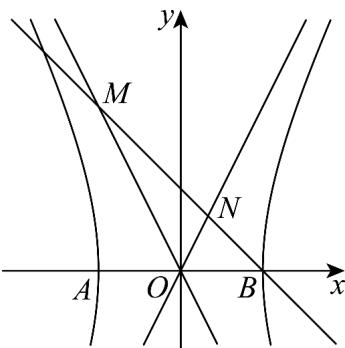

> [!faq]- 《专题11 双曲线标准方程及其性质高频题型精准突破（十大题型）（高效培优期末专项训练）》官方解析
>
> > [!success]- **【答案】** D
>
> > [!note]- **【分析】**
> > 将双曲线渐近线分别与直线 $y = -x + a$ 联立，求得 A, B 两点的横坐标，结合 MN = 2NB 可得 b = 2a ，运算得解.
>
> > [!note]- **【解析】**
> > 因为渐近线方程 $y=\pm\frac{b}{a}x$ ，所以 $\left\{\begin{aligned}y&=\frac{b}{a}x\\ y&=-x+a\end{aligned}\right.$ ，解得 $x_{N}=\frac{a^{2}}{a+b}$ ，同理 $x_{M}=\frac{a^{2}}{a-b}$ ，
> >
> > 由 $\overline{MN} = 2\overline{NB}$ ，则 $\frac{a^2}{a + b} -\frac{a^2}{a - b} = 2\left(a - \frac{a^2}{a + b}\right)$ ，即 $\frac{2a^2b}{b^2 - a^2} = \frac{2ab}{a + b}$ ，整理得 $b = 2a$
> >
> > 所以离心率 $e = \sqrt{1 + \left(\frac{b}{a}\right)^2} = \sqrt{5}$
> >
> > 故选：D.
> >
> > 
