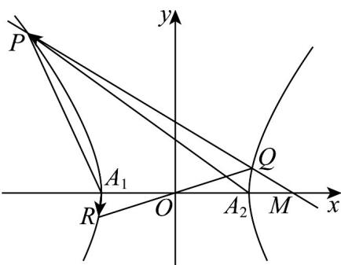

> [!faq]- 《专题11 双曲线标准方程及其性质高频题型精准突破（十大题型）（高效培优期末专项训练）》官方解析
>
> > [!success]- **【答案】** (1) $\sqrt{3}$ (2) $P\left(-2, 2\sqrt{2}\right)$ (3) $b\in\left(0,\frac{\sqrt{3}}{3}\right)\cup\left(\frac{\sqrt{3}}{3},\frac{\sqrt{6}}{3}\right]$
>
> > [!note]- **【分析】**
> > （1）根据离心率以及双曲线方程计算可得 $b=\sqrt{3}$ ；
> >
> > (2) 由 $\triangle MA_{1}P$ 为等腰三角形对底边进行分类讨论，求出点 $P$ 的轨迹并与双曲线联立即可解得 $P$ 的坐标；
> >
> > (3) 设点 $P(x_{1}, y_{1}), Q(x_{2}, y_{2})$ ，根据双曲线对称性可得 $R(-x_{2}, -y_{2})$ ，对直线斜率分类讨论并与双曲线联立，
> >
> > 由数量积的坐标表示可得 $m^2 = \frac{2}{b^2} - 30$ ，即求出结果
>
> > [!note]- **【解析】**
> > （1）由题意得 $e = \frac{c}{a} = \frac{c}{1} = 2$ ，则 $c = 2$ ；
> >
> > 因此 $b = \sqrt{2^2 - 1} = \sqrt{3}$
> >
> > (2) 当 $b = \frac{2\sqrt{6}}{3}$ 时，双曲线 $\Gamma: x^{2} - \frac{y^{2}}{\frac{8}{3}} = 1$ ，其中 $M(2,0), A_{1}(-1,0)$ ，
> >
> > 如下图所示：
> >
> > 
> >
> > 因为 $\triangle MA_{1}P$ 为等腰三角形，则
> >
> > 当以 $MA_{1}$ 为底时，显然点 $P$ 在直线 $x = \frac{1}{2}$ 上，这与点 $P$ 在第二象限矛盾，故舍去；
> >
> > 当以 $A_{1}P$ 为底时， $\left|MP\right| = \left|MA_1\right| = 3$
> >
> > 设 $P(x,y)$ ，则点 $P$ 的轨迹是以 $M(2,0)$ 为圆心，半径为3的圆，
> >
> > 其方程为 $(x-2)^{2}+y^{2}=9$ ；
> >
> > 联立 $\left\{ \begin{array}{l} x^{2} - \frac{3y^{2}}{8} = 1 \\ (x - 2)^{2} + y^{2} = 9 \end{array} \right.$ ，解得 $\left\{ \begin{array}{l} x = \frac{23}{11} \\ y = \frac{8\sqrt{17}}{11} \end{array} \right.$ 或 $\left\{ \begin{array}{l} x = \frac{23}{11} \\ y = -\frac{8\sqrt{17}}{11} \end{array} \right.$ 或 $\left\{ \begin{array}{l} x = -1 \\ y = 0 \end{array} \right.$ ；
> >
> > 因为点 $P$ 在第二象限，显然不合题意，舍去；
> >
> > 当以 $MP$ 为底时， $\left|A_{1}P\right| = \left|M A_{1}\right| = 3$
> >
> > 设 $P\left(x_0,y_0\right)$ ，其中 $x_0 < 0,y_0 > 0$ ，则点 $P$ 的轨迹是以 $A_{1}(-1,0)$ 为圆心，半径为3的圆，
> >
> > $$
> > \left(x _ {0} + 1\right) ^ {2} + y _ {0} ^ {2} = 9
> > $$
> >
> > 则有 $\left\{ \begin{array}{l} x_0^2 - \frac{3y_0^2}{8} = 1 \\ (x_0 + 1)^2 + y_0^2 = 9 \end{array} \right.$ 解得 $P(-2, 2\sqrt{2})$
> >
> > $$
> > P \left(- 2, 2 \sqrt {2}\right)
> > $$
> >
> > $$
> > A _ {1} (- 1, 0), A _ {2} (1, 0)
> > $$
> >
> > $$
> > A _ {1} R \cdot A _ {2} P = 0
> > $$
> >
> > $$
> > k _ {l} \neq 0
> > $$
> >
> > $$
> > x = m y + 2
> > $$
> >
> > $$
> > P \left(x _ {1}, y _ {1}\right), Q \left(x _ {2}, y _ {2}\right)
> > $$
> >
> > $$
> > O Q
> > $$
> >
> > $$
> > R \left(- x _ {2}, - y _ {2}\right)
> > $$
> >
> > $$
> > \left\{ \begin{array}{l} x = m y + 2 \\ x ^ {2} - \frac {y ^ {2}}{b ^ {2}} = 1 \end{array} \right.
> > $$
> >
> > $$
> > \left(b ^ {2} m ^ {2} - 1\right) y ^ {2} + 4 b ^ {2} m y + 3 b ^ {2} = 0,
> > $$
> >
> > 显然二次项系数 $b^{2}m^{2} - 1 \neq 0$
> >
> > $$
> > \Delta = \left(4 b ^ {2} m\right) ^ {2} - 4 \left(b ^ {2} m ^ {2} - 1\right) 3 b ^ {2} = 4 b ^ {4} m ^ {2} + 1 2 b ^ {2} > 0
> > $$
> >
> > $$
> > y _ {1} + y _ {2} = \frac {- 4 b ^ {2} m}{b ^ {2} m ^ {2} - 1} (1), y _ {1} y _ {2} = \frac {3 b ^ {2}}{b ^ {2} m ^ {2} - 1} (2)
> > $$
> >
> > 可得 $A_{1}R = (-x_{2} + 1, - y_{2}), A_{2}P = (x_{1} - 1, y_{1})$
> >
> > 则 $A_{1}R\cdot A_{2}P = (-x_{2} + 1)(x_{1} - 1) - y_{1}y_{2} = 1$ ，因为 $P(x_1,y_1),Q(x_2,y_2)$ 在直线 $l$ 上，
> >
> > 则 $x_{1} = my_{1} + 2, x_{2} = my_{2} + 2$
> >
> > 即 $\left(m^2 + 1\right)y_1y_2 + m\left(y_1 + y_2\right) + 2 = 0$
> >
> > 将①②代入有 $\left(m^{2}+1\right)\cdot\frac{3b^{2}}{b^{2}m^{2}-1}+m\cdot\frac{-4b^{2}m}{b^{2}m^{2}-1}+2=0$ ，
> >
> > 即 $b^{2}m^{2} + 3b^{2} - 2 = 0$
> >
> > 所以 $m^2 = \frac{2}{b^2} - 3$ ，代入到 $b^2 m^2 - 1 \neq 0$ ，得 $b^2 \neq \frac{1}{3}$ .
> >
> > 且 $m^2 = \frac{2}{b^2} - 3$ 0，解得 $b^2 \leq \frac{2}{3}$ ，则 $b^2 \in \left(0, \frac{1}{3}\right) \cup \left(\frac{1}{3}, \frac{2}{3}\right]$ ，
> >
> > 因此 $b \in \left(0, \frac{\sqrt{3}}{3}\right) \cup \left(\frac{\sqrt{3}}{3}, \frac{\sqrt{6}}{3}\right]$ .
> >
> > 所以 $b$ 的取值范围为 $\left(0, \frac{\sqrt{3}}{3}\right) \cup \left(\frac{\sqrt{3}}{3}, \frac{\sqrt{6}}{3}\right]$ .
