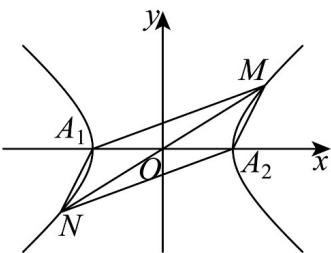

> [!faq]- 《专题11 双曲线标准方程及其性质高频题型精准突破（十大题型）（高效培优期末专项训练）》官方解析
>
> > [!success]- **【答案】** (1) $\frac{x^{2}}{4}-\frac{y^{2}}{3}=1,(x\neq\pm2)$ (2)10
>
> > [!note]- **【分析】**
> > （1）由题意列出方程 $\frac{y}{x + 2} \cdot \frac{y}{x - 2} = \frac{3}{4}, (x \neq \pm 2)$ ，化简即得 $C$ 的方程；
> >
> > (2) 结合图形由 $A_{1}A_{2}=A_{1}M+A_{1}N$ 推得 $MA_{2}=A_{1}N$ ，继而推出 $\Box A_{1}MA_{2}N$ ，设直线 $A_{1}N$ 的方程为
> >
> > $y = k(x + 2)$ ，与双曲线方程联立，求出点 $N$ 的坐标，由对称性得点 $M$ 的坐标，由四边形 $A_{1}MA_{2}N$ 的面积为 $^{12}$ 列出方程，解之求得 $k$ 的值，继而可求出 $|MN|$ 的值·
>
> > [!note]- **【解析】**
> > （1）依题意，可得 $\frac{y}{x + 2} \cdot \frac{y}{x - 2} = \frac{3}{4}, (x \neq \pm 2)$ ，化简得 $\frac{x^2}{4} - \frac{y^2}{3} = 1, (x \neq \pm 2)$
> >
> > 故 C 的方程为 $\frac{x^{2}}{4}-\frac{y^{2}}{3}=1,(x\neq\pm2)$ .
> >
> > (2)
> >
> > 
> >
> > 如图，因 $A_{1}A_{2} = A_{1}M + MA_{2}$ ，依题意， $A_{1}A_{2} = A_{1}M + A_{1}N$ ，故得 $MA_{2} = A_{1}N$
> >
> > 则四边形 $A_{1}MA_{2}N$ 为平行四边形·因直线 $A_{1}N$ 得斜率必存在，故可设其斜率为 $k$
> >
> > 则直线 $A_{1}N$ 的方程为 $y = k(x + 2)$ ，代入双曲线方程，
> >
> > 整理得： $(3-4k^{2})x^{2}-16k^{2}x-16k^{2}-12=0$ ，则 $\Delta>0$ ，
> >
> > 由 $-2x_{N} = -\frac{16k^{2} + 12}{3 - 4k^{2}}$ ，可得 $x_{N} = \frac{8k^{2} + 6}{3 - 4k^{2}}$ ，将其代入 $y = k(x + 2)$ ，解得 $y_{N} = \frac{12k}{3 - 4k^{2}}$
> >
> > 即得 $N\left(\frac{8k^2 + 6}{3 - 4k^2}, \frac{12k}{3 - 4k^2}\right)$
> >
> > 由上已得 $\square A_{1}MA_{2}N$ ，故点 $M$ 与点 $N$ 关于原点对称，故点 $M$ 的坐标为 $M\left(\frac{8k^2 + 6}{4k^2 - 3},\frac{12k}{4k^2 - 3}\right)$ 又因四边形 $A_{1}MA_{2}N$ 的面积 $S_{A_1MA_2N} = 2S_{\triangle MA_1A_2} = 2\times \frac{1}{2}\times |A_1A_2|\times |y_M|$ $= 4\times |\frac{12k}{4k^2 - 3}| = 12$ ，解得 $k = \pm \frac{1}{2}$ 或 $k = \pm \frac{3}{2}$
> >
> > 而 $|MN|=2|OM|=2\sqrt{(\frac{8k^{2}+6}{4k^{2}-3})^{2}+(\frac{12k}{4k^{2}-3})^{2}}$ 故当 $k=\pm\frac{1}{2}$ 时， $|MN|=2\sqrt{(\frac{8}{-2})^{2}+(\frac{\pm6}{-2})^{2}}=10$ ；
> > 当 $k=\pm\frac{3}{2}$ 时， $|MN|=2\sqrt{(\frac{24}{6})^{2}+(\frac{\pm18}{6})^{2}}=10$ .
> > 综上，可得 $\left|MN\right|$ 的值为10.
