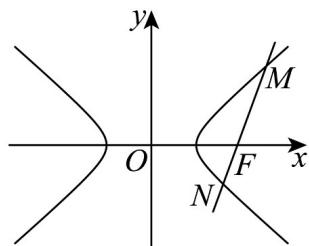

> [!faq]- 《专题11 双曲线标准方程及其性质高频题型精准突破（十大题型）（高效培优期末专项训练）》官方解析
>
> > [!success]- **【答案】** (1) $x^{2}-\frac{y^{2}}{3}=1$ (2) $t + 1$ (3)证明见解析
>
> > [!note]- **【分析】**
> > （ $^{1}$ ）根据题意列方程组，即可求得答案；
> >
> > (2) 设 $P(x_{0}, y_{0})$ ， $x_{0} \leq -1$ ，表示出 $|PA|$ ，结合二次函数性质可得答案；
> >
> > (3) 讨论直线斜率是否存在，存在时，设直线方程并联立双曲线方程，可得根与系数关系，求出 $\frac{1}{|MF|} + \frac{1}{|NF|}$ 的表达式，化简即可证明结论·
>
> > [!note]- **【解析】**
> > （1）因为双曲线 $C$ 过点(2,3)，一条渐近线方程为 $\sqrt{3} x - y = 0$
> >
> > 所以 $\left\{ \begin{array}{l} \frac{4}{a^2} - \frac{9}{b^2} = 1 \\ \frac{b}{a} = \sqrt{3} \end{array} \right.$ ，解得 $\left\{ \begin{array}{l} a = 1 \\ b = \sqrt{3} \end{array} \right.$ ，
> >
> > <!-- source-part:2 pages:51-67 -->
> >
> > 则双曲线 C 的标准方程为 $x^{2}-\frac{y^{2}}{3}=1$ ；
> >
> > (2) 因为点 P 为双曲线左支上一点，
> >
> > 设 $P\left(x_0,y_0\right)$ ， $x_0\leq -1$ ，则 $x_0^2 -\frac{y_0^2}{3} = 1$ ，即 $y_0^2 = 3x_0^2 -3$ ，又因为 $A(t,0)(t > 0)$
> >
> > 所以 $|PA| = \sqrt{(x_0 - t)^2 + y_0^2} = \sqrt{(x_0 - t)^2 + 3x_0^2 - 3} = \sqrt{4x_0^2 - 2tx_0 + t^2 - 3} = \sqrt{4(x_0 - \frac{t}{4})^2 + \frac{3}{4}t^2 - 3}$
> >
> > 因为 $x_0 \leq -1$ ， $\frac{t}{4} > 0$
> >
> > 则 $x_0 = -1$ 时， $|PA|$ 取得最小值 $\sqrt{4(-1 - \frac{t}{4})^2 + \frac{3}{4} t^2 - 3} = t + 1$ .
> >
> > (3) 证明：当过点 $F(2,0)$ 的直线斜率不存在时，直线方程为 $x = 2$
> >
> > 此时可取 $M(2,3)$ ， $N(2, - 3)$ ，则 $\frac{1}{|MF|} +\frac{1}{|NF|} = \frac{1}{3} +\frac{1}{3} = \frac{2}{3}$
> >
> > 当过点 $F(2,0)$ 的直线斜率存在时，
> >
> > 设直线方程为 $y = k(x - 2)$ ， $M(x_1, y_1)$ ， $N(x_2, y_2)$ ，不妨设 $x_1 > 2$ ， $1 < x_2 < 2$ ，
> >
> > 因为直线过双曲线的右焦点 $F(2,0)$ ，且双曲线的一条渐近线方程为 $\sqrt{3} x - y = 0$
> >
> > 则 $k < -\sqrt{3}$ 或 $k > \sqrt{3}$
> >
> > 联立 $\left\{ \begin{array}{l} y = k(x - 2) \\ x^2 - \frac{y^2}{3} = 1 \end{array} \right.$ ，消去 并整理得 $y$ $(3 - k^2)x^2 + 4k^2x - 4k^2 - 3 = 0$
> >
> > 所以 $\Delta=16k^{4}-4(3-k^{2})(-4k^{2}-3)=36k^{2}+36>0$
> >
> > 由韦达定理得 $x_{1} + x_{2} = \frac{-4k^{2}}{3 - k^{2}}, x_{1}x_{2} = \frac{-4k^{2} - 3}{3 - k^{2}}$
> >
> > 所以 $\frac{1}{|MF|} +\frac{1}{|NF|} = \frac{1}{\sqrt{1 + k^2}|x_1 - 2|} +\frac{1}{\sqrt{1 + k^2}|x_2 - 2|}$
> >
> > $$
> > = \frac {1}{\sqrt {1 + k ^ {2}}} \cdot \frac {x _ {1} - x _ {2}}{2 (x _ {1} + x _ {2}) - x _ {1} x _ {2} - 4} = \frac {1}{\sqrt {1 + k ^ {2}}} \cdot \frac {\sqrt {(x _ {1} + x _ {2}) ^ {2} - 4 x _ {1} x _ {2}}}{2 (x _ {1} + x _ {2}) - x _ {1} x _ {2} - 4}
> > $$
> >
> > $$
> > = \frac {1}{\sqrt {1 + k ^ {2}}} \cdot \frac {\sqrt {\left(\frac {- 4 k ^ {2}}{3 - k ^ {2}}\right) ^ {2} - 4 \cdot \frac {- 4 k ^ {2} - 3}{3 - k ^ {2}}}}{2 \left(\frac {- 4 k ^ {2}}{3 - k ^ {2}}\right) - \frac {- 4 k ^ {2} - 3}{3 - k ^ {2}} - 4} = \frac {1}{\sqrt {1 + k ^ {2}}} \cdot \frac {\sqrt {\frac {1 6 k ^ {4} + 4 (4 k ^ {2} + 3) (3 - k ^ {2})}{(3 - k ^ {2}) ^ {2}}}}{\frac {- 9}{3 - k ^ {2}}}
> > $$
> >
> > $$
> > = \frac {1}{\sqrt {1 + k ^ {2}}} \cdot \frac {\frac {6 \sqrt {k ^ {2} + 1}}{- (3 - k ^ {2})}}{\frac {- 9}{3 - k ^ {2}}} = \frac {1}{\sqrt {1 + k ^ {2}}} \cdot \frac {6 \sqrt {k ^ {2} + 1}}{9} = \frac {2}{3}.
> > $$
> >
> > 综上所述， $\frac{1}{|MF|}+\frac{1}{|NF|}$ 为定值·
> >
> > 
