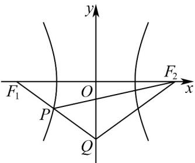

> [!faq]- 《专题11 双曲线标准方程及其性质高频题型精准突破（十大题型）（高效培优期末专项训练）》官方解析
>
> > [!success]- **【答案】** C
>
> > [!note]- **【分析】**
> > 由双曲线的定义得出 $\left|PF_{2}\right|=4+\left|PF_{1}\right|$ ，即得出 $\triangle PQF_{2}$ 的周长为 $\left|PQ\right|+\left|PF_{2}\right|+\left|QF_{2}\right|\quad\left|QF_{1}\right|+\left|QF_{2}\right|+4$ ，
> > 由点 P 为线段 $QF_{1}$ 与双曲线的交点时， $\triangle PQF_{2}$ 周长取最小值，即可求解.
>
> > [!note]- **【解析】**
> > 如下图所示：
> >
> > 
> >
> > 在双曲线 $\frac{x^2}{4} -\frac{y^2}{12} = 1$ 中， $a = 2$ ， $b = 2\sqrt{3}$ ，则 $c = \sqrt{a^2 + b^2} = 4$ ，则 $F_{1}(-4,0)$ 、 $F_{2}(4,0)$ ，由双曲线的定义可得 $\left|PF_2\right| - \left|PF_1\right| = 2a = 4$ ，所以 $\left|PF_2\right| = 4 + \left|PF_1\right|$ 所以 $\Delta PQF_{2}$ 的周长为 $\left|PQ\right| + \left|PF_2\right| + \left|QF_2\right| = \left|PQ\right| + 4 + \left|PF_1\right| + \left|QF_2\right|$ $|QF_1| + |QF_2| + 4 = 2|QF_1| + 4$ $= 2\sqrt{(0 + 4)^2 + (-3 - 0)^2} +4 = 14$
> >
> > 当且仅当点 P 为线段 $QF_{1}$ 与双曲线的交点时，等号成立，
> >
> > 故 $\triangle PQF_{2}$ 周长的最小值为14·
> >
> > 故选 **C**.
