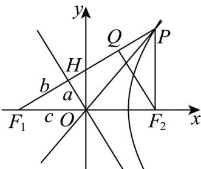

> [!faq]- 《专题11 双曲线标准方程及其性质高频题型精准突破（十大题型）（高效培优期末专项训练）》官方解析
>
> > [!success]- **【答案】** A．双曲线的实轴长为 4 B．双曲线的离心率为 $\frac{\sqrt{11}}{2}$ C．四边形 $OF_{2}PH$ 的面积为 15 D． $\overline{PH} = 2HF_{1}$
>
> > [!note]- **【分析】**
> > 根据题意作图，利用双曲线性质和给定条件，解出 $a = 2$ ，利用三角形边角关系解出 $b = 3, c = \sqrt{13}$ 从而依次对各选项内容进行计算和判断，选项A，B，根据双曲线性质，实轴长为 $2a = 4$ ，离心率 $e = \frac{c}{a} = \frac{\sqrt{13}}{2}$ ；选项C：根据 $OF_{2}PH$ 面积等于 $\triangle F_1PF_2$ 的面积减去△ $F_{1}HO$ 的面积计算；选项D：根据三角形边角关系得出 $\left|\stackrel {\mathrm{UUU}}{PH}\right| = \left|\stackrel {\mathrm{UUU}}{PQ}\right| + \left|\stackrel {\mathrm{UUU}}{QH}\right| = 2\left|\stackrel {\mathrm{UUU}}{HF_1}\right|$ ，且 $\stackrel {\mathrm{UUU}}{PH},\stackrel {\mathrm{UUU}}{HF_1}$ 共线且方向相同，得出 $\stackrel {\mathrm{UUU}}{PH} = 2\stackrel {\mathrm{UUU}}{HF_1}$
>
> > [!note]- **【解析】**
> > 
> >
> > 已知 $H$ 是过 $F_{1}$ 作 $C$ 的一条渐近线的垂线 $l$ 的垂足，其渐近线方程为： $y = -\frac{b}{a} x$ ， $F_{1}(-c,0)$ ，根据点到直线距离公式， $d = |F_{1}H| = \frac{|-c \cdot b|}{\sqrt{a^{2} + b^{2}}} = \frac{c \cdot b}{c} = b$ ， $|OH| = \sqrt{c^{2} - b^{2}} = a$ 。过点 $F_{2}$ 向 $F_{1}P$ 做垂线，垂足为 $Q$ ，因为 $OH \perp F_{1}Q, F_{2}Q \perp F_{1}Q$ ，所以 $OH \parallel F_{2}Q$ ，又 $O$ 为 $F_{1}F_{2}$ 中点且 $|OH| = a$ ，则 $|F_{2}Q| = 2a$ 。由 $\cos \angle F_{1}PF_{2} = \frac{3}{5}$ ，可得 $\sin \angle F_{1}PF_{2} = \sqrt{1 - \left(\frac{3}{5}\right)^{2}} = \frac{4}{5}$ ， $\tan \angle F_{1}PF_{2} = \frac{4}{3}$ ，
> >
> > 在 $Rt\triangle PQF_{2}$ 中， $\left|PF_2\right| = \frac{\left|F_2Q\right|}{\sin\angle F_1PF_2} = \frac{2a}{\frac{4}{5}} = 5$ ，解得 $a = 2$
> >
> > $$
> > \left\{ \begin{array}{l} \left| P F _ {1} \right| - \left| P F _ {2} \right| = 2 a = 4 \\ \left| P F _ {1} \right| = \left| F _ {1} Q \right| + \left| Q P \right| = 2 b + \frac {2 a}{\tan \angle F _ {1} P F _ {2}} \end{array} \Rightarrow \left\{ \begin{array}{l} \left| P F _ {1} \right| = 9 \\ 2 b + \frac {4}{\left(\frac {4}{3}\right)} = 9 \Rightarrow b = 3, c = \sqrt {1 3} \end{array} \right. \right.
> > $$
> >
> > 所以：实轴长 $2a = 4$ ，故 $\mathsf{A}$ 对；离心率 $e = \frac{c}{a} = \frac{\sqrt{13}}{2}$ ，故 $\mathsf{B}$ 错； $\triangle PF_{1}F_{2}$ 的面积 $S_{1} = \frac{1}{2}|F_{1}P||F_{2}P|\sin \angle F_{1}PF_{2} = \frac{1}{2}\cdot 9\cdot 5\cdot \sqrt{1 - \left(\frac{3}{5}\right)^{2}} = 18$ ， $S_{\triangle F_1HO} = \frac{1}{2} ab = \frac{1}{2}\cdot 2\cdot 3 = 3$ ，所以 $S_{OF_2PH} = S_1 - S_{\triangle F_1HO} = 18 - 3 = 15$ ，故 $\mathsf{C}$ 对· $\triangle F_{1}F_{2}Q$ 中， $F_{2}Q\perp PF_{1}$ ， $OH\perp PF_{1}$ ， $O$ 为 $F_{1}F_{2}$ 中点， $\therefore H$ 为 $F_{1}Q$ 中点，即 $|F_1H| = |HQ| = b = 3$ ，又 $\tan \angle F_1PF_2 = \frac{|QF_2|}{|PQ|} = \frac{2a}{|PQ|} = \frac{4}{3}$ ， $\therefore |PQ| = \frac{3}{2} a = 3$ ， $\therefore \left|\overline{PUH}\right| = \left|\overline{PUQ}\right| + \left|\overline{QUH}\right| = 2\left|\overline{UHF}_1\right|$ ，又∵ $\overline{PUH},\overline{UHF}_1$ 共线且方向相同，∴ $\overline{PUH} = 2\overline{HF}$ ，故 $\mathsf{D}$ 对·
> >
> > 故选 **ACD**.
