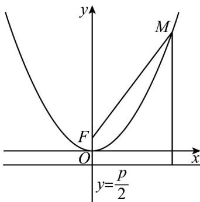

> [!faq]- 《专题12 抛物线标准方程及其性质高频题型精准突破（八大题型）（高效培优期末专项训练）》官方解析
>
> > [!success]- **【答案】** D
>
> > [!note]- **【分析】**
> > 利用抛物线定义有 $\left|MF\right|=3+\frac{p}{2}$ ，结合已知求p即可·
>
> > [!note]- **【解析】**
> > 设焦点为 $F$ ，则 $\left|MF\right|=3+\frac{p}{2}=5p$ ，解得 $p=\frac{2}{3}$
> >
> > 
> >
> > 故选 **D**
