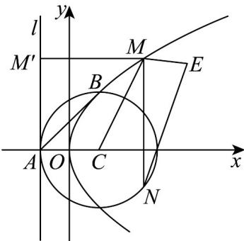

> [!faq]- 《专题12 抛物线标准方程及其性质高频题型精准突破（八大题型）（高效培优期末专项训练）》官方解析
>
> > [!success]- **【答案】** A. $p = 2$ B. 点 $B$ 到 $D$ 的准线的距离为 2 C. 直线 $AB$ 与抛物线 $D$ 相交 D. 若点 $E(4,3)$ ，则 $\left|ME\right| + \left|MN\right|$ 的最小值为 3
>
> > [!note]- **【分析】**
> > 由抛物线的性质求得 p 判断 A，根据抛物线的定义判断 B，由直线与抛物线的位置关系判断 C，根据抛物线的定义与圆的性质判断 D.
>
> > [!note]- **【解析】**
> > 对于 A 选项，因为 D 的准线 $x = -\frac{p}{2}$ 与圆 C 相切，则 $-\frac{p}{2} = -1$ ，即 p = 2，A 正确；
> >
> > 对于 B 选项，由 A 可知抛物线焦点即为圆心 $C(1,0)$ ，则由抛物线定义知点 B 到 D 的准线的距离等于 $|BC| = 2$ ，B 正确；
> >
> > 对于 $\mathbb{C}$ 选项，点 $A(-1,0)$ ，设 $B(x_1,y_1)$ ，则由 $\mathbb{B}$ 选项知 $x_1 + 1 = 2$ ， $x_1 = 1$ ，可得 $B(1,\pm 2)$ ， $k_{AB} = \pm 1$
> >
> > 抛物线方程 $y^{2}=4x$ ，对应函数为 $y=\pm2\sqrt{x}$ ，导函数为 $y'=\pm\frac{1}{\sqrt{x}}$ ，
> >
> > 则点 B 处的切线斜率为 $\pm1$ ，则直线 AB 与抛物线相切，C 错误；
> >
> > 对于 $\mathsf{D}$ 选项，点 $E(4,3)$ 位于抛物线内， $|ME| + |MN|$ 的最小值等价于 $|ME| + |MC| - 2$ 的最小值，
> >
> > 过点 M 作准线的垂线，垂足为 $M'$ ，则 $\left|ME\right| + \left|MC\right| = \left|ME\right| + \left|MM'\right|$ ， $\left|ME\right| + \left|MM'\right|$ 的最小值为点 E 到准线的距离，即为 5，
> >
> > 则 $\left|ME\right|+\left|MN\right|$ 最小值为5-2=3，D正确.
> >
> > 
> >
> > 故选 **ABD**.
