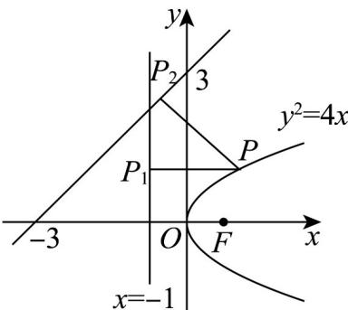

> [!faq]- 《专题12 抛物线标准方程及其性质高频题型精准突破（八大题型）（高效培优期末专项训练）》官方解析
>
> > [!success]- **【答案】** B
>
> > [!note]- **【分析】**
> > 根据抛物线的定义把点 P 到 l 的距离转化到点 P 到焦点 F 的距离，就是求点 F 到直线的距离.
>
> > [!note]- **【解析】**
> > 设过点 $P$ 分别向准线 $l$ 和 $x - y + 3 = 0$ 作垂线，垂足分别为 $P_{1}, P_{2}$
> >
> > 因为抛物线 $y^{2} = 4x$ 的焦点 $F(1,0)$ ，由抛物线的定义得： $\left|PP_{1}\right| = \left|PF\right|$
> >
> > 所以只需要求 $\left|PF\right|+\left|PP_{2}\right|$ 最小即可.
> >
> > 当且仅当 $F, P, P_{2}$ 三点共线时 $\left|PF\right| + \left|PP_{2}\right|$ 最小，且最小值为点 F 到直线 $x - y + 3 = 0$ 的距离，即
> >
> > $$
> > \frac {\left| 1 - 0 + 3 \right|}{\sqrt {2}} = 2 \sqrt {2}
> > $$
> >
> > 故选：B.
> >
> > 
