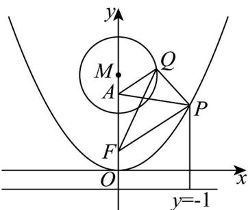

> [!faq]- 《专题12 抛物线标准方程及其性质高频题型精准突破（八大题型）（高效培优期末专项训练）》官方解析
>
> > [!success]- **【答案】** $\frac{1}{2} / 0.5$ 5
>
> > [!note]- **【分析】**
> > 根据题意可得圆的方程为 $x^{2} + y^{2} = 10y - 21$ ，结合两点间距离公式运算求解即可得 $\frac{|QA|}{|QF|} = \frac{1}{2}$ ；由 $|QA| = \frac{1}{2}|QF|$ 结合几何性质可得 $|PF| + |PQ| + \frac{1}{2}|QF|$ $|PF| + |AP|$ ，再结合抛物线的定义分析求解·
>
> > [!note]- **【解析】**
> > 由题意可知：抛物线 $C: x^{2} = 4y$ 的焦点为 $F(1,0)$ ，准线为 y = -1，
> > 设 $Q(x,y)$ ，圆 $M:x^{2}+(y-5)^{2}=4$ ，即为 $x^{2}+y^{2}=10y-21$ ，
> >
> > $$
> > \frac {\left| Q A \right|}{\left| Q F \right|} = \frac {\sqrt {x ^ {2} + (y - 4) ^ {2}}}{\sqrt {x ^ {2} + (y - 1) ^ {2}}} = \frac {\sqrt {x ^ {2} + y ^ {2} - 8 y + 1 6}}{\sqrt {x ^ {2} + y ^ {2} - 2 y + 1}} = \frac {\sqrt {1 0 y - 2 1 - 8 y + 1 6}}{\sqrt {1 0 y - 2 1 - 2 y + 1}} = \frac {\sqrt {2 y - 5}}{\sqrt {8 y - 2 0}} = \frac {1}{2}
> > $$
> >
> > 
> >
> > 因为 $\left|QA\right| = \frac{1}{2}\left|QF\right|$ ，则 $\left|PF\right| + \left|PQ\right| + \frac{1}{2}\left|QF\right| = \left|PF\right| + \left|PQ\right| + \left|QA\right| \quad \left|PF\right| + \left|AP\right|$ ，
> >
> > 当且仅当 $A, Q, P$ 三点共线时，等号成立，
> >
> > 设点 $P$ 到准线 $y = -1$ 的距离为 $d$
> >
> > 则 $\left|PF\right| + \left|AP\right| = d + \left|AP\right|$ 5，当且仅当P为坐标原点O时，等号成立，
> >
> > 综上所述： $\left|PF\right|+\left|PQ\right|+\frac{1}{2}\left|QF\right|$ 5
> >
> > 当且仅当 $P$ 为坐标原点 $O$ ， $Q$ 为 $(0,3)$ 时，等号成立，
> >
> > 所以 $\left|PF\right|+\left|PQ\right|+\frac{1}{2}\left|QF\right|$ 的最小值为 5.
> >
> > 故答案为： $\frac{1}{2}$ ; 5.
