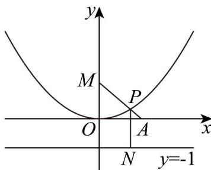

> [!faq]- 《专题12 抛物线标准方程及其性质高频题型精准突破（八大题型）（高效培优期末专项训练）》官方解析
>
> > [!success]- **【答案】** A
>
> > [!note]- **【分析】**
> > 由抛物线焦半径公式可得 $d = |PM| - 1$ ， $\left|PA\right| + d = \left|PA\right| + \left|PM\right| - 1$ $|AM| - 1$ ，当且仅当 $P, A, M$ 三点共线时，等号成立，从而求出距离之和的最小值·
>
> > [!note]- **【解析】**
> > 抛物线 $y = \frac{1}{4} x^2 \Rightarrow x^2 = 4y$ ，焦点坐标为 $M(0,1)$ ，准线方程为 $y = -1$ ，设 $P$ 到 $x$ 轴的距离为 $d$ ，过点 $P$ 作 $PN \perp$ 准线 $y = -1$ 于点 $N$ ，由抛物线焦半径公式可得 $\left|PN\right| = \left|PM\right|$ ， $d = \left|PM\right| - 1$
> >
> > 
> >
> > 则 $\left|PA\right|+d=\left|PA\right|+\left|PM\right|-1$ $\left|AM\right|-1$ ，当且仅当P,A,M三点共线时，等号成立，
> > 其中 $\left|AM\right|=\sqrt{1^{2}+1^{2}}=\sqrt{2}$ ，所以 P 到点 A 的距离与 P 到 x 轴的距离之和最小值为 $\sqrt{2}-1$
> >
> > 故选 **A**
