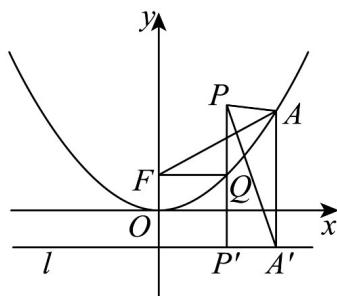

> [!faq]- 《专题12 抛物线标准方程及其性质高频题型精准突破（八大题型）（高效培优期末专项训练）》官方解析
>
> > [!success]- **【答案】** B
>
> > [!note]- **【分析】**
> > 根据抛物线的定义，求出抛物线的标准方程，根据抛物线的定义，判断出线段和的最小值，求出结果·
>
> > [!note]- **【解析】**
> > 
> >
> > 抛物线 $x^{2} = 2py(p > 0)$ 上的点 $A$ 到抛物线焦点 $F$ 距离的最小值为1，则有 $\frac{p}{2} = 1$ ，解得 $p = 2$ ，
> >
> > 在抛物线 $x^{2} = 4y$ 中，当 $x = 2$ 时， $y = 1 < 3$
> >
> > 因此点 $P(2,3)$ 在抛物线 $x^{2}=4y$ 上方.
> >
> > 过点 P 作 $PP' \perp$ 准线 l 于 $P'$ ，交抛物线于点 Q，连接 QF，过 A 作 $AA' \perp$ 准线 l 于 $A'$ ，连接 $PA'$ ，如图，显然 $\left|AP\right| + \left|AF\right| = \left|AP\right| + \left|AA'\right| \quad \left|PA'\right| \quad \left|PP'\right| = \left|PQ\right| + \left|QP'\right| = \left|PQ\right| + \left|QF\right|$ 。
> >
> > 当且仅当点 A 与点 Q 重合时取等号，所以 $\left(\left|AP\right|+\left|AF\right|\right)_{\min}=\left|PP'\right|=3-(-1)=4$
> >
> > 故选 **B**.
