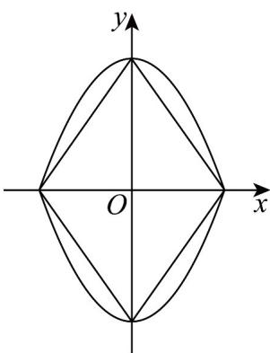

> [!faq]- 《专题12 抛物线标准方程及其性质高频题型精准突破（八大题型）（高效培优期末专项训练）》官方解析
>
> > [!success]- **【答案】** ABD
>
> > [!note]- **【分析】**
> > 对于选项 $^{A}$ ，作出曲线E的图象与曲线 $\left|\sqrt{2}x\right|+\left|y\right|=2$ 的图象即可判断；对于选项 $^{B}$ 结合中心对称的概念即可判断；对于选项 $^{C}$ ，设曲线E上任意一点为 $(x,y)$ ，结合两点间的距离公式化简整理即可判断；对于选项 $^{D}$ ，结合点到直线的距离公式即可判断。
>
> > [!note]- **【解析】**
> > 对于选项 $^{A}$ ，作出曲线E的图象，即可判断为封闭图形，再作出 $\left|\sqrt{2}x\right|+\left|y\right|=2$ 的图象，
> >
> > 
> >
> > 由图可知曲线 $E$ 围成的面积大于 $\left|\sqrt{2} x\right| + |y| = 2$ 曲线围成的面积，且曲线 $\left|\sqrt{2} x\right| + |y| = 2$ 与 $x$ 轴正半轴的交点坐标为 $(\sqrt{2},0)$ ，与 $y$ 轴正半轴的交点坐标为 $(0,2)$ ，所以围成的面积为 $4 \times \frac{1}{2} \times \sqrt{2} \times 2 = 4\sqrt{2}$ ，所以选项A正确；对于选项B，因为点 $(-x,y)$ ，点 $(x,-y)$ 均满足方程，则可得到曲线 $E$ 关于原点中心对称，所以选项B正确；对于选项C，设曲线 $E$ 上任意一点为 $(x,y)$ ，则其到原点的距离的平方为 $x^2 + y^2$ ，且 $x^2 + y^2 = 2 - |y| + y^2 = 2 - |y| + |y|^2 = \left(|y| - \frac{1}{2}\right)^2 + \frac{7}{4}$ 、 $\frac{7}{4}$ ，即曲线 $E$ 上的点到原点距离的最小值为 $\frac{\sqrt{7}}{2}$ ，故选项C错误；
> > 对于选项D，曲线 $E$ 上任意一点为 $(x,y)$ ，则其到直线 $x + y = 4$ 距离为 $d = \frac{|x + y - 4|}{\sqrt{2}} = \frac{x + x^2 - 2 + 4}{\sqrt{2}} = \frac{\left(x - \frac{1}{2}\right)^2 + \frac{7}{4}}{\sqrt{2}}$ 、 $\frac{7\sqrt{2}}{8}$ ，故选项D正确；
> >
> > 故选 **ABD**
