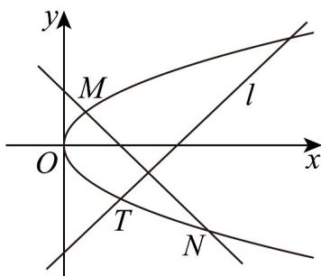

> [!faq]- 《专题12 抛物线标准方程及其性质高频题型精准突破（八大题型）（高效培优期末专项训练）》官方解析
>
> > [!success]- **【答案】** (1) $x=-\frac{1}{2}$ ，x-y-4=0； (2) $x + y - 2 = 0$
>
> > [!note]- **【分析】**
> > （1）由点在抛物线上求参数值，即可得抛物线，进而得准线方程，应用点斜式写出直线方程；
> >
> > (2) 设直线 $MN$ 的方程为 $y = -x + n$ ，联立抛物线有 $n > -\frac{1}{2}$ ，且 $MN$ 的中点坐标为 $(n + 1, -1)$ ，再由点在直线上求参数，即可得直线方程·
>
> > [!note]- **【解析】**
> > （1）如图，因为 $T(2, - 2)$ 在抛物线 $C:y^{2} = 2px$ 上，所以 $\left(-2\right)^{2} = 2p\times 2$ ，解得 $p = 1$
> >
> > 所以抛物线 $C$ 为 $y^{2} = 2x$ ，其准线方程为 $x = -\frac{1}{2}$
> >
> > 
> >
> > 因为直线 l 的斜率为 1，所以直线 l 的方程为 $y-(-2)=x-2$ ，即 x-y-4=0；
> >
> > (2) 由 (1)，设直线 $MN$ 的方程为 $y = -x + n$
> >
> > 由 $\left\{\begin{aligned}y&=-x+n\\ y^{2}&=2x\end{aligned}\right.$ ，消去 x 得 $y^{2}+2y-2n=0$ ，由 $\Delta=4+8n>0$ ，解得 $n>-\frac{1}{2}$ .
> >
> > 设 $M(x_{1},y_{1}),N(x_{2},y_{2})$ ，则 $y_{1} + y_{2} = -2$ ，于是线段MN的中点坐标为 $(n + 1, - 1)$
> >
> > 显然点 $(n + 1, - 1)$ 在直线 $l:y = x - 4$ 上，即 $-1 = n + 1 - 4$ ，解得 $n = 2 > - \frac{1}{2}$ ，符合题意，
> >
> > 所以直线 MN 的方程为 $x + y - 2 = 0$ .
