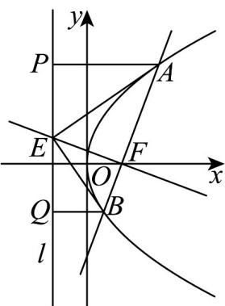
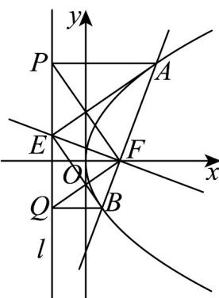

> [!faq]- 《专题12 抛物线标准方程及其性质高频题型精准突破（八大题型）（高效培优期末专项训练）》官方解析
>
> > [!success]- **【答案】** (1) $y^{2}=6x$ (2)① 证明见解析；②18
>
> > [!note]- **【分析】**
> > （1）设直线 $AB$ 的方程为 $x = my + \frac{p}{2}$ ，与抛物线方程联立，得到韦达定理，利用 $\left|AB\right| = x_1 + x_2 + p$ ，解出未知数，得到方程；
> >
> > (2) ①验证 $AB \perp x$ 轴时成立，再求解当 $AB$ 不垂直于 $x$ 轴时，直线 $EF$ 的方程，令 $x = -\frac{3}{2}$ ，得 $y_E$ ，直接判断；
> >
> > ②方法一，连接 PF，QF，证明 $FP \perp FQ$ ，再证明 $k_{EA} \cdot k_{EB} = -1$ 得到 $AE \perp BE$ ，设直线 AB 的倾斜角为 $\theta$ ， $|AE|\cdot|BE|$ 表示为 $\frac{18}{\sin^{3}\theta}$ ，求解即可；
> >
> > 方法二，同方法一证得 $AE \perp BE$ ，利用相似得到 $\left|AE\right|^2 = \left|AF\right|\cdot \left|AB\right|$ ， $\left|BE\right|^2 = \left|BF\right|\cdot \left|AB\right|$ ，表示出 $\left|AF\right|\cdot \left|BF\right|$ 以及 $\left|AB\right|$ ，带入求解即可·
>
> > [!note]- **【解析】**
> > （1）因为抛物线 $C:y^{2} = 2px(p > 0)$ ，所以焦点为 $F\left(\frac{p}{2},0\right)$ ，准线 $l$ 为 $x = -\frac{p}{2}$
> >
> > 如图，易知直线 $AB$ 的斜率不为 $0$ ，设直线 $AB$ 的方程为 $x = my + \frac{p}{2}$ ， $A(x_1, y_1)$ ， $B(x_2, y_2)$
> >
> > 
> >
> > 联立 $\left\{ \begin{array}{l}x = my + \frac{p}{2}\\ y^2 = 2px \end{array} \right.$ ，得 $y^{2} - 2pmy - p^{2} = 0$
> >
> > 易知 $\Delta > 0$ ，则 $y_{1} + y_{2} = 2pm$ ， $y_{1}y_{2} = -p^{2}$ ，
> >
> > 又 $x_{1} = my_{1} + \frac{p}{2}$ ， $x_{2} = my_{2} + \frac{p}{2}$
> >
> > 所以 $\left|AB\right|=x_{1}+x_{2}+p=m\left(y_{1}+y_{2}\right)+2p=2pm^{2}+2p\quad2p$ ，当且仅当m=0时取等号，
> >
> > 因为 $\left|AB\right|$ 的最小值为 6，所以 2p = 6，p = 3，
> >
> > 所以抛物线的标准方程为 $y^{2} = 6x$ .
> >
> > (2) ① 当 $AB \perp x$ 轴时， $E\left(-\frac{3}{2}, 0\right)$ ， $|PE| = |EQ|$ .
> >
> > 当 $AB$ 不垂直于 $x$ 轴时，设直线 $AB$ 的方程为 $x = my + \frac{3}{2}$ ， $m \neq 0$ ，
> >
> > 则直线 $EF$ 的方程为 $x = -\frac{1}{m} y + \frac{3}{2}$
> >
> > 令 $x = -\frac{3}{2}$ ，得 $y_{E} = 3m = \frac{y_{1} + y_{2}}{2}$ ，即 $E$ 为 $PQ$ 的中点，所以 $|PE| = |EQ|$
> >
> > 综上可得， $\left|PE\right|=\left|EQ\right|$
> > - **②**：方法一 如图，连接 $k_{FP} = \frac{y_P}{-\frac{3}{2} - \frac{3}{2}} = -\frac{y_1}{3}$ ， $k_{FQ} = \frac{y_Q}{-\frac{3}{2} - \frac{3}{2}} = -\frac{y_2}{3}$ ，
> >
> > 
> >
> > 所以 $k_{FP} \cdot k_{FQ} = \frac{y_{1} y_{2}}{9} = \frac{-9}{9} = -1$ ，则 $FP \perp FQ \cdot$
> >
> > 由①知， $E$ 为 $PQ$ 的中点，故 $\left|EF\right| = \frac{1}{2}\left|PQ\right|$
> >
> > 设直线 $AB$ 的倾斜角为 $\theta$ ， $\theta \in (0,\pi)$ ，可得 $|PQ| = |AB|\sin \theta$ ，则 $|EF| = \frac{1}{2}|AB|\sin \theta$
> >
> > $$
> > k _ {E A} \cdot k _ {E B} = \frac {\left(y _ {E} - y _ {1}\right) \left(y _ {E} - y _ {2}\right)}{\left(- \frac {3}{2} - x _ {1}\right) \left(- \frac {3}{2} - x _ {2}\right)} = \frac {- \left(y _ {1} - y _ {2}\right) ^ {2}}{4 (m y _ {1} + 3) (m y _ {2} + 3)} = \frac {- \left[ \left(y _ {1} + y _ {2}\right) ^ {2} - 4 y _ {1} y _ {2} \right]}{4 \left[ m ^ {2} y _ {1} y _ {2} + 3 m \left(y _ {1} + y _ {2}\right) + 9 \right]} = \frac {- 3 6 (m ^ {2} + 1)}{3 6 (m ^ {2} + 1)} = - 1
> > $$
> >
> > 所以 $AE \perp BE \cdot$
> >
> > 所以 $\left|AE\right|\cdot\left|BE\right|=\left|AB\right|\cdot\left|EF\right|=\left|AB\right|\cdot\frac{1}{2}\left|AB\right|\sin\theta=\frac{1}{2}\left|AB\right|^{2}\sin\theta$
> >
> > 因为 $\left|AF\right| = \left|AP\right| = p + \left|AF\right|\cos \theta$ ，所以 $\left|AF\right| = \frac{p}{1 - \cos \theta}$ ，同理 $\left|BF\right| = \frac{p}{1 + \cos \theta}$ ，
> >
> > 则 $\left|AB\right|=\left|AF\right|+\left|BF\right|=\frac{2p}{\sin^{2}\theta}$
> >
> > 所以 $\left|AE\right|\cdot\left|BE\right|=\frac{1}{2}\cdot\frac{36}{\sin^{4}\theta}\sin\theta=\frac{18}{\sin^{3}\theta}$ 18，
> >
> > 所以 $|AE|\cdot|BE|$ 的最小值为18.
> >
> > 方法二 同方法一证得 $AE \perp BE$
> >
> > 在 Rt△ ABE 与 Rt△AEF 中，∠BAE = ∠EAF
> >
> > 所以 $\mathrm{Rt}\triangle ABE\sim \mathrm{Rt}\triangle AEF$ ，则 $\frac{|AE|}{|AB|} = \frac{|AF|}{|AE|}$ ，即 $|AE|^2 = |AF|\cdot |AB|$
> >
> > 同理可得 $\left|BE\right|^{2}=\left|BF\right|\cdot\left|AB\right|$ .
> >
> > $$
> > \text {又} \left| A F \right| \cdot \left| B F \right| = \left(x _ {1} + \frac {3}{2}\right) \left(x _ {2} + \frac {3}{2}\right) = (m y _ {1} + 3) (m y _ {2} + 3) = m ^ {2} y _ {1} y _ {2} + 3 m (y _ {1} + y _ {2}) + 9 = - 9 m ^ {2} + 1 8 m ^ {2} + 9 = 9 (m ^ {2} + 1)
> > $$
> >
> > $$
> > \left| A B \right| = 6 m ^ {2} + 6 = 6 (m ^ {2} + 1)
> > $$
> >
> > 所以 $\left|AE\right|^{2}\cdot\left|BE\right|^{2}=\left|BF\right|\cdot\left|AF\right|\cdot\left|AB\right|^{2}=9\left(m^{2}+1\right)\times36\left(m^{2}+1\right)^{2}$
> >
> > 则 $\left|AE\right|\cdot\left|BE\right|=3\left(m^{2}+1\right)^{\frac{1}{2}}\times6\left(m^{2}+1\right)=18\left(m^{2}+1\right)^{\frac{3}{2}}$ 18，所以 $\left|AE\right|\cdot\left|BE\right|$ 的最小值为18.
