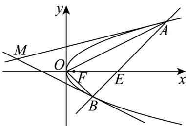
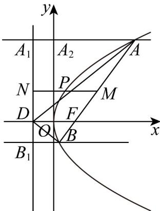

> [!faq]- 《专题12 抛物线标准方程及其性质高频题型精准突破（八大题型）（高效培优期末专项训练）》官方解析
>
> > [!success]- **【答案】** A. $x_{1}x_{2} = 6$ B. 直线 $AB$ 过点 $(2,0)$ C. $\triangle ABO$ 与 $\mathrm{VAFO}$ 面积之和的最小值是3 D. 过 $A$ ， $B$ 两点分别作抛物线的两条切线，设两条切线交于点 $M$ ，则 $MN \parallel x$ 轴
>
> > [!note]- **【分析】**
> > 设 AB : $x = my + n$ ，联立方程后得关于 y 的一元二次方程，由韦达定理写出 $y_{1}y_{2} = -n$ ， $x_{1}x_{2}=y_{1}^{2}y_{2}^{2}=n^{2}$ ，再由 $OA\cdot OB=2$ ，即可得 $n^{2}-n=2$ ，再结合 $y_{1}y_{2}<0$ ，求解出 n=2，从而判断 AB，再根据三角形面积公式表示出 $\triangle ABO$ 与 VAFO 的面积，由基本不等式可判断 C，不妨令点 A 在第一象限，则点 B 在第四象限，设切线为 $x=t(y-\sqrt{x_{1}})+x_{1}$ ，联立利用相切得到 $t=2\sqrt{x_{1}}$ ，即切线为 $x=2\sqrt{x_{1}}y-x_{1}$ ，同理可得在点 B 处的切线方程为 $x=-2\sqrt{x_{2}}y-x_{2}$ ，得到 $y_{M}=\frac{\sqrt{x_{1}}-\sqrt{x_{2}}}{2}=\frac{y_{1}+y_{2}}{2}$ 即可。
>
> > [!note]- **【解析】**
> > 设直线 $AB: x=my+n, \left\{\begin{aligned}x&=my+n\\ y^{2}&=x\end{aligned}\right.$ ，消 可得 $y^{2}-my-n=0$ $y_{1}y_{2}=-n$ ，得 $x_{1}x_{2}=y_{1}^{2}y_{2}^{2}=n^{2}$ ，∵ $OA\cdot OB=2$ ，∴ $n^{2}-n=2$ ，则 n=2 或 -1 $\because y_{1}y_{2}<0,\therefore n>0,\therefore n=2,x_{1}x_{2}=4$ ，故 A 错；
> > 直线 AB : $x=my+2$ 过 $(2,0)$ ，故 B 对； $S_{\triangle ABO} + S_{\triangle AFO} = |y_1 - y_2| + \frac{1}{2} \cdot |y_1| \cdot \frac{1}{4} = |y_1 - y_2| + \frac{1}{8}|y_1|$ 不妨设 $y_{1}>0$ ，又 $F(\frac{1}{4},0)$ ， $S_{\triangle ABO} + S_{\triangle AFO} = y_{1} - y_{2} + \frac{1}{8}y_{1} = \frac{9}{8}y_{1} - y_{2} - 2\sqrt{-\frac{9}{8}y_{1}y_{2}} = 3$
> >
> > 当且仅当 $\frac{9}{8} y_1 = -y_2$ 时，取等号，故 $C$ 对；
> >
> > 由对称性，不妨令点 A 在第一象限，则点 B 在第四象限，当 y > 0 时， $y = \sqrt{x}$ ，则 $y_{1} = \sqrt{x_{1}}$ ，
> > 易知切线斜率不为零，设切线为 $x = t(y - \sqrt{x_{1}}) + x_{1}$ ，
> > 联立曲线得 $y^{2}-ty+t\sqrt{x_{2}}-x_{1}=0$ ，又因为相切，
> > 所以 $\Delta=t^{2}-4\sqrt{x_{1}}t+4x_{1}=\left(t-2\sqrt{x_{1}}\right)^{2}=0$ ，解得 $t=2\sqrt{x_{1}}$ 则过在点 A 处的切线方程为 $x=2\sqrt{x_{1}}y-x_{1}$ 当 y<0 时， $y=-\sqrt{x}$ ，同理可得在点 B 处的切线方程为 $x=-2\sqrt{x_{2}}y-x_{2}$ 联立解得交点 M 的纵坐标 $y_{M}=\frac{\sqrt{x_{1}}-\sqrt{x_{2}}}{2}=\frac{y_{1}+y_{2}}{2}$ 又 AB 中点 N 坐标为 $\left(\frac{x_{1}+x_{2}}{2},\frac{y_{1}+y_{2}}{2}\right)$ 当 $y_{1} + y_{2} = 0$ 时，MN 在 x 轴上，故 D 错误.
> >
> > 
> >
> > 故选：BC
> >
> > 44. 抛物线 $y^{2} = 4x$ 的焦点为 $F$ ，过 $F$ 的直线交抛物线于 $A, B$ ，以下说法正确的有（）
> >
> > 【答案】
> >
> > A．以 $AF$ 为直径的圆与 $y$ 轴相切
> >
> > B．以 $AB$ 为直径的圆与抛物线的准线相离
> >
> > C．若点 $D$ 为抛物线准线与 $x$ 轴交点，则一定有 $\angle ADF = \angle BDF$ D．过线段 $AB$ 的中点 $M$ 作 $y$ 轴的垂线，交抛物线于点 $P$ ，交抛物线的准线于点 $N$ ，则
> >
> > $$
> > \left| P M \right| = \left| P N \right|
> > $$
> >
> > 【答案】ACD
> >
> > 【分析】
> >
> > 对于 A，设点 A 在 y 轴上的投影为 $A_{2}$ ，在准线上的投影为 $A_{1}$ ，O 为坐标原点， $|AF| = a$ ，求以 AF 为直径的圆的半径和 AF 的中点到 y 轴的距离，由此判断 A，对于 B，设点 A, B 在准线上的投影为 $A_{1}, B_{1}$ ， $|BF| = b$ ，根据抛物线的定义可得线段 AB 的中点到准线的距离为 $\frac{|AB|}{2}$ ，从而可判断 B；对于 C，设直线 AB 方程为 $x = my + 1$ ，利用设而不求法求 $k_{AD} + k_{BD}$ ，由此判断 C，对于 D，设线段 AB 的中点 $M(x_{0}, y_{0})$ ，根据 C 的解答求 M, P, N 的坐标，由此判断 D.
> >
> > 【详解】对于 $A$ ，设点 $A$ 在 $y$ 轴上的投影为 $A_{2}$ ，在准线上的投影为 $A_{1}$ ， $O$ 为坐标原点， $\left|AF\right| = a$
> >
> > 则 $\left|OF\right|=\left|A_{1}A_{2}\right|=1,\quad\left|AA_{1}\right|=\left|AF\right|=a$
> >
> > 因为以 $AF$ 为直径的圆的半径为 $\frac{a}{2}$
> >
> > $AF$ 的中点到 $y$ 轴的距离为 $\frac{\left|AA_{2}\right|+\left|OF\right|}{2}=\frac{\left|AA_{2}\right|+\left|A_{1}A_{2}\right|}{2}=\frac{\left|AA_{1}\right|}{2}=\frac{\left|AF\right|}{2}=\frac{a}{2}$
> >
> > 故以 $AF$ 为直径的圆与 $y$ 轴相切，故 $\mathsf{A}$ 正确；
> >
> > 对于 $B$ ，设点 $B$ 在准线上的投影为 $B_{1}$ ， $\left|BF\right| = b$ ，则 $\left|BB_1\right| = b$
> >
> > 所以线段 $AB$ 的中点到准线的距离为 $\frac{|AA_1| + |BB_1|}{2} = \frac{a + b}{2} = \frac{|AF| + |BF|}{2} = \frac{|AB|}{2}$
> >
> > 所以以线段 AB 为直径的圆与准线 l 相切，故 B 错误；
> >
> > 对于 $\mathbb{C}$ ，点 $D$ 为抛物线准线与 $x$ 轴交点，所以 $D\left(-\frac{p}{2},0\right)$
> >
> > 若直线 $AB$ 的斜率为0，则直线 $AB$ 与抛物线有且只有一个交点，矛盾，
> >
> > 故可设直线 AB 方程为 $x = my + 1$ ，
> >
> > 联立 $\left\{ \begin{array}{l} x = my + 1 \\ y^2 = 4x \end{array} \right.$ ，消去 $x$ ，得 $y^2 - 4my - 4 = 0$ ，
> >
> > 方程 $y^{2}-4my-4=0$ 的判别式 $\Delta=16(m^{2}+1)>0$
> >
> > 所以 $y_{1} + y_{2} = 4m$ ， $y_{1}y_{2} = -4$
> >
> > $$
> > k _ {A D} + k _ {B D} = \frac {y _ {1}}{x _ {1} + 1} + \frac {y _ {2}}{x _ {2} + 1} = \frac {x _ {1} y _ {2} + x _ {2} y _ {1} + (y _ {1} + y _ {2})}{(x _ {1} + 1) (x _ {2} + 1)} = \frac {(m y _ {1} + 1) y _ {2} + (m y _ {2} + 1) y _ {1} + (y _ {1} + y _ {2})}{(m y _ {1} + 1 + 1) (m y _ {2} + 1 + 1)}
> > $$
> >
> > $= \frac{2my_1y_2 + 2(y_1 + y_2)}{m^2y_1y_2 + 2m(y_1 + y_2) + 4} = 0$ ，所以 $\angle ADF = \angle BDF$ ，故C正确；
> > 对于D，设线段 $AB$ 的中点 $M(x_0,y_0)$ ，
> > 由C选项的解析可得 $y_{0} = \frac{y_{1} + y_{2}}{2} = 2m$ ， $x_0 = my_0 + 1 = 2m^2 +1$ ，
> > 所以 $M(2m^2 +1,2m)$ ， $P(m^2,2m)$ ， $N(-1,2m)$ ，
> > 所以 $\left|PM\right| = m^2 +1 = \left|PN\right|$ ，故D正确；
> >
> > 故选：ACD.
> >
> > 
