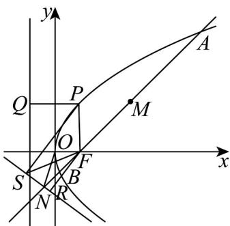

> [!faq]- 《专题12 抛物线标准方程及其性质高频题型精准突破（八大题型）（高效培优期末专项训练）》官方解析
>
> > [!success]- **【答案】** (1) $2(2)\frac{5}{7}$ (3)2
>
> > [!note]- **【分析】**
> > （1）由抛物线方程写出焦点坐标，设出直线方程，联立并写出韦达定理，根据中点坐标公式，可得答案；
> >
> > (2) 联立直线方程求交点，利用三角形的面积公式，可得答案；
> >
> > (3) 由题意作图，由图中的线段组合以及三角形三边关系，利用点到直线距离公式，可得答案
>
> > [!note]- **【解析】**
> > （1）由题得 $C$ 的焦点为 $F\left(\frac{p}{2},0\right)$ ，设 $l$ 为 $y = x - \frac{p}{2}$
> >
> > 设 $A(x_{1},y_{1})$ ， $B(x_{2},y_{2})$ ， $M(3,y_0)$
> >
> > 联立方程 $\left\{ \begin{array}{l} y = x - \frac{p}{2} \\ y^2 = 2px \end{array} \right.$ ，化简得： $x^{2} - 3px + \frac{p^{2}}{4} = 0$
> >
> > $\Delta = 9p^{2} - p^{2} > 0$ ，则 $x_{1} + x_{2} = 3p = 6$ $\therefore p = 2$
> >
> > (2) 由 (1) 得 $F(1,0)$
> >
> > 联立方程 $\left\{ \begin{array}{l} y = x - 1 \\ 3x + 4y + 7 = 0 \end{array} \right.$ ，解得 $N\left(-\frac{3}{7}, -\frac{10}{7}\right)$ ， $S_{\triangle OFN} = \frac{1}{2} \times |OF| \times |y_N| = \frac{5}{7}$ .
> >
> > (3)
> >
> > 
> >
> > 由（1）得 C 的方程为 $y^{2}=4x$
> >
> > 由抛物线定义可知，点 P 到准线的距离等于点 P 到焦点 F 的距离，
> >
> > 联立方程 $\left\{ \begin{array}{l} y^{2} = 4x \\ 3x + 4y + 7 = 0 \end{array} \right.$ ，化简得： $\frac{3}{4} y^{2} + 4y + 7 = 0$
> >
> > 由 $\Delta = 16 - 4 \times \frac{3}{4} \times 7 = -5 < 0$ ，得 $C$ 与 $l'$ 相离，
> >
> > 设 $Q$ ，S， $R$ 分别是过点 $P$ 向准线、直线 $l': 3x + 4y + 7 = 0$ 以及过点 $F$ 向直线 $l': 3x + 4y + 7 = 0$ 引垂线的垂足，连接 $FP$ ，FS，
> >
> > 所以点 $P$ 到 $C$ 的准线的距离与点 $P$ 到直线 $l^{\prime}$ 的距离之和 $\left|PQ\right| + \left|PS\right| = \left|PF\right| + \left|PS\right|$ $\left|FS\right|$ $\left|FR\right|$
> >
> > 当且仅当点 P 为线段 FR 与抛物线的交点时等号成立，
> >
> > 所以 $P$ 到 $C$ 的准线的距离与 $P$ 到 $l^{\prime}$ 的距离之和的最小值为点 $F(1,0)$ 到直线 $l^{\prime}:3x + 4y + 7 = 0$ 的距离，
> >
> > $$
> > \left(\left| P Q \right| + \left| P S \right|\right) _ {\min} = \left| F R \right| = \frac {\left| 3 \times 1 + 0 + 7 \right|}{\sqrt {3 ^ {2} + 4 ^ {2}}} = 2,
> > $$
> >
> > 47. 直线 $y = x - 1$ 被抛物线 $y^{2} = 4x$ 截得的线段 $AB$ 的中点坐标是（）.
> >
> > 【答案】
> > A. (2,1) B. (3,2) C. (6,5) D. (4,3)
> >
> > 【答案】B
> >
> > 【分析】联立直线与抛物线方程，由韦达定理和中点坐标公式即可得解·
> >
> > 【详解】联立 $\left\{ \begin{array}{l} y = x - 1 \\ y^2 = 4x \end{array} \right. \Rightarrow x^2 - 6x + 1 = 0$ ，则 $\Delta = (-6)^2 - 4 \times 1 \times 1 = 32 > 0$ ，
> >
> > 设直线 $y = x - 1$ 与抛物线交点 $A(x_{1},y_{1}),B(x_{2},y_{2})$
> >
> > 则 $x_{1} + x_{2} = 6$ ，故 $y_{1} + y_{2} = (x_{1} - 1) + (x_{2} - 1) = x_{1} + x_{2} - 2 = 4$
> >
> > 所以线段 AB 的中点坐标是 $(3,2)$ .
> >
> > 故选 **B**.
