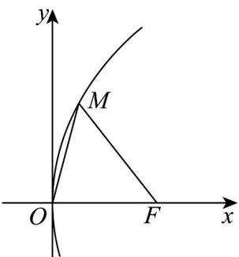

> [!faq]- 《专题12 抛物线标准方程及其性质高频题型精准突破（八大题型）（高效培优期末专项训练）》官方解析
>
> > [!success]- **【答案】** C
>
> > [!note]- **【解析】**
> > 由题意可知： $F\left(\frac{p}{2},0\right)$
> >
> > 因为 $\cos \angle OFM = \frac{3}{5}$ ，且 $\angle OFM \in (0, \pi)$ ，可知 $\angle OFM$ 为锐角，
> >
> > $$
> > \sin \angle O F M = \sqrt {1 - \cos^ {2} \angle O F M} = \frac {4}{5}, \tan \angle O F M = \frac {\sin \angle O F M}{\cos \angle O F M} = \frac {4}{3}
> > $$
> >
> > 设 $M\left(x_0,y_0\right)$ ，则 $0 <   x_{0} <   \frac{p}{2}$
> >
> > 
> >
> > 则 $\left\{ \begin{array}{l} y_0^2 = 2px_0 \\ \frac{|y_0|}{\frac{p}{2} - x_0} = \frac{4}{3} \\ 8x_0^2 - 17px_0 + 2p^2 = 0 \end{array} \right.$ ，整理可得，解得或（舍去）， $x_0 = \frac{p}{8}$ $x_0 = 2p$
> >
> > 所以 $M$ 的横坐标为 $\frac{p}{8}$
> >
> > 故选 **C**.
