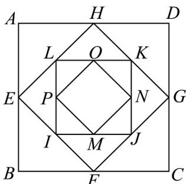

> [!faq]- 《专题14 等比数列高频题型精准突破（十大题型）（高效培优期末专项训练）》官方解析
>
> > [!success]- **【答案】**  A. $\frac{63}{32}$ B. $\frac{31}{4}$ C. $\frac{63}{8}$ D. 8
>
> > [!note]- **【分析】**
> > 根据正方形的性质，结合等比数列的定义、性质、前 $n$ 项和公式进行求解即可·【详解】因为正方形ABCD的边长为 $2\mathrm{cm}$ ，所以正方形ABCD的对角线为 $\sqrt{2^2 + 2^2} = 2\sqrt{2}$ ，
>
> > [!note]- **【解析】**
> > 所以第二个正方形 $EFGH$ 的边长为 $\frac{1}{2} \times 2\sqrt{2} = \sqrt{2}$ ，所以第二个正方形 $EFGH$ 的对角线为 $\frac{1}{2} \times \sqrt{\left(\sqrt{2}\right)^2 + \left(\sqrt{2}\right)^2} = 1$ ，所以第三个正方形 $EFGH$ 的边长为 $\frac{1}{2} \times 1 = \frac{1}{2}$ ，所以这些正方形的边长为 $2$ 为首项， $\frac{\sqrt{2}}{2}$ 为公比的等比数列，所以这些正方形的面积为 $4$ 为首项， $\frac{1}{2}$ 为公比的等比数列因此前 $6$ 个正方形面积和为 $\frac{4\left[1 - \left(\frac{1}{2}\right)^6\right]}{1 - \frac{1}{2}} = \frac{63}{8}$ ，
> >
> > 故选 **C**
